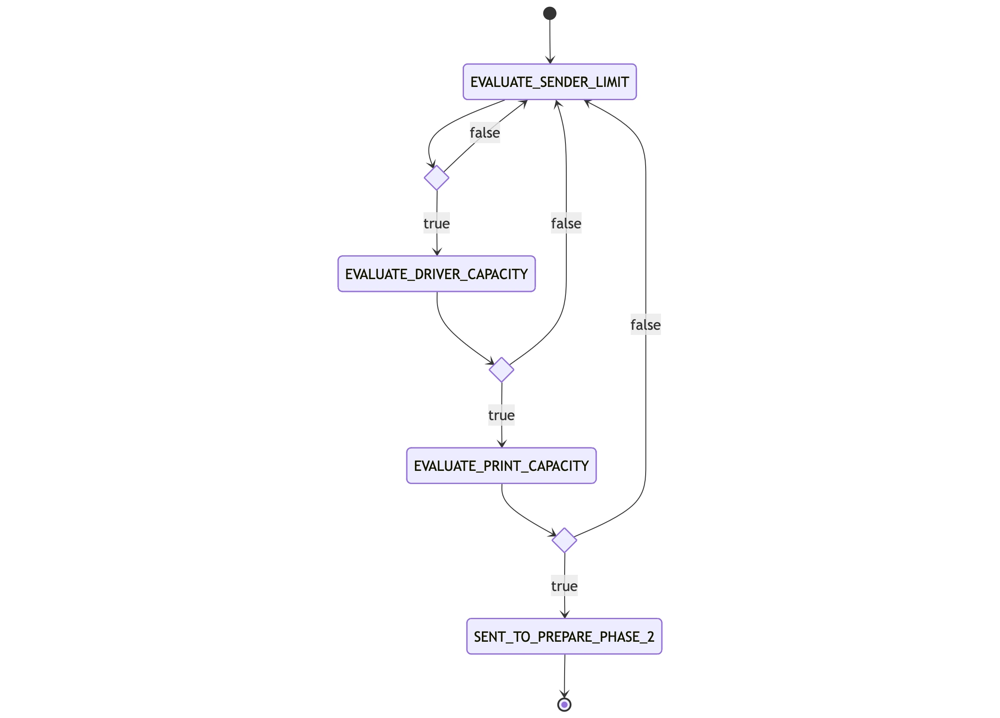

# pn-delayer
Repository contenente i componenti realizzati per gestire in modo efficiente i picchi di recapito in modo tale da:
- Non appesantire i recapitisti sulla base di spedizioni ricevute dalle notifiche create dagli enti mittenti.
- Far rispettare le stime dichiarate dai mittenti, in modo tale da dare priorità alle spedizioni che rispettano le stime.
- Non appesantire lo "stampatore" garantendo al massimo 180 mila spedizioni (configurabile) inviate giornalmente al consolidatore.

## Panoramica
Si compone di:
- AWS **Step Functions**:
    - **BatchWorkflowStateMachine**: definisce il workflow di pianificazione delle spedizioni coordinando l'esecuzione
      dei job di valutazione dei limiti garantiti al mittente, della capacità di recapito settimanali, e dei residui delle capacità di recapito settimanale. (1 volta a settimana il Lunedì)
    - **DelayerToPaperChannelStateMachine**: definisce il workflow di valutazione della capacità di stampa giornaliera e l'invio delle spedizioni alla prepare fase 2. (tutti i giorni 1 volta al giorno)
- AWS **Lambda**:
    - **pn-delayer-kinesisPaperDeliveryLambda**: gestisce la ricezione degli eventi Kinesis relativi alla prepare fase 1 e la scrittura sulle tabelle `pn-DelayerPaperDelivery` e `pn-PaperDeliveryCounters`.
    - **pn-delayer-submitPaperDeliveryJobLambda**: Si occupa della submit dei Job di schedulazione spedizioni.  Viene lanciata dalla Step Function `BatchWorkflowStateMachine`.
    - **pn-delayerToPaperChannelLambda**: responsabile della lettura delle spedizioni con `workflowStep = EVALUATE_PRINT_CAPACITY` dalla tabella `pn-DelayerPaperDelivery` e scrittura sulla coda `pn-delayer_to_paperchannel`.
        Viene lanciata dalla Step Function `DelayerToPaperChannelStateMachine`.
- Microservizio Spring Boot 3
    - **pn-delayer**: Contiene i job di valutazione dei limiti garantiti al mittente, della capacità di recapito  settimanali.
      A seconda del valore della variabile `PN_DELAYER_WORKFLOWSTEP` avvia il job corrispondente.

  | WorkFlowStep                 | Descrizione                                                                 |
      |------------------------------|-----------------------------------------------------------------------------|
  | `EVALUATE_SENDER_LIMIT`      | Avvia il job di valutazione limite settimanale garantito al mittente        | 
  | `EVALUATE_DRIVER_CAPACITY`   | Avvia il job di valutazione della capacità di recapito settimanale          | 
  | `EVALUATE_RESIDUAL_CAPACITY` | Avvia il job di valutazione dei residui di capacità di recapito settimanale | 

Per le spedizioni in eccesso, cioè che superano:
- "definitivamente" i limiti garantiti (cioè, che non possono essere recuperate dal batch dei residui perché non vi è capacità di recapito residua)
- le capacità di recapito
- "definitivamente" le capacità di stampa (cioè, non c'è capacità di stampa nell'ultimo giorno della settimana)

vengono creati i record nella tabella `pn-DelayerPaperDelivery` con `workflowStep = EVALUATE_SENDER_LIMIT` e deliveryDate alla settimana successiva, in modo tale da essere valutati
alla prossima esecuzione settimanale della Step Function `BatchWorkflowStateMachine`.

### Workflow delle spedizione nell’algoritmo di pianificazione

Siccome l’algoritmo prevede la valutazione dei seguenti step:
- Valutazione limite settimanale garantito al mittente.
- Valutazione capacità di recapito settimanale.
- Valutazione capacità di stampa giornaliera.

ogni spedizione potrà subire i seguenti i cambi di stati durante l’esecuzione dell’algoritmo:

### Architettura

## Pn-delayer-kinesisPaperDeliveryLambda
### Responsabilità
- Lettura degli eventi del Kinesis Data Stream `pn-delayer_inputs` relativi alla prepare fase 1
- Inserimento di tali eventi sulle tabelle `pn-DelayerPaperDelivery` e `pn-PaperDeliveryCounters`

### Configurazione
| Variabile Ambiente                        | Descrizione                                                                                                                                      | Obbligatorio | Default |
|-------------------------------------------|--------------------------------------------------------------------------------------------------------------------------------------------------|--------------|---------|
| REGION                                    |                                                                                                                                                  | Sì           |         |
| KINESIS_PAPER_DELIVERY_TABLE_NAME         | Nome della tabella DynamoDB contenente il workflow delle richieste di spedizione elaborate dall'algoritmo di pianificazione                      | Sì           |         |
| KINESIS_PAPER_DELIVERY_COUNTER_TABLE_NAME | Nome della tabella DynamoDB per i contatori di RS e Secondi tentativi, il contatore della capacità di stampa, e i contatori dei moduli commessa  | Sì           |         |
| KINESIS_BATCH_SIZE                        | Dimensione massima del batch per l'elaborazione delle notifiche                                                                                  | No           | 25      |

### pn-delayer-sender-limit-job

#### Responsabilità
- Recupera le spedizioni che si trovano nello step EVALUATE_SENDER_LIMIT per la settimana corrente.
- Calcola il limite settimanale, garantito al mittente basato sulle percentuali garantite ai mittenti basate sui moduli commessa,
  applicate alla capacità di recapito settimanale al netto di RS e Secondi tentativi.
- Smista le spedizioni tra gli step EVALUATE_DRIVER_CAPACITY (spedizioni che rientrano nel limite garantito al mittente)
  e EVALUATE_RESIDUAL_CAPACITY (spedizioni che eccedono il limite garantito al mittente)
- Legge dalle tabelle: PaperDeliveryCounterTable, PaperDeliverySenderLimitTable, PaperDeliveryUsedSenderLimitTable, PaperDeliveryDriverCapacitiesTable, PaperDeliveryTable
- Scrive sulle tabelle DynamoDB: PaperDeliveryUsedSenderLimitTable

#### Configurazione
| Variabile Ambiente                                    | Descrizione                                                                                                                                     | Default | Obbligatorio |
|-------------------------------------------------------|-------------------------------------------------------------------------------------------------------------------------------------------------|---------|--------------|
| PN_DELAYER_PAPERDELIVERYPRIORITYPARAMETERNAME         | Nome del parametro contenente l'ordine di priorità delle spedizioni                                                                             | -       | Si           |
| PN_DELAYER_DAO_PAPERDELIVERYQUERYLIMIT                | Query limit per la tabella contenente le spedizioni                                                                                             | 1000    | No           |
| PN_DELAYER_DAO_PAPERDELIVERYCOUNTERTABLENAME          | Nome della tabella DynamoDB per i contatori di RS e Secondi tentativi, il contatore della capacità di stampa, e i contatori dei moduli commessa | -       | Si           |
| PN_DELAYER_DAO_PAPERDELIVERYSENDERLIMITTABLENAME      | Nome della tabella DynamoDB contenente le stime dei mittenti derivanti dai moduli commessa                                                      | -       | Si           |
| PN_DELAYER_DAO_PAPERDELIVERYUSEDSENDERLIMITTABLENAME  | Nome della tabella DynamoDB contenente le spedizioni inviate allo step successivo raggruppate per mittente-prodotto-provincia                   | -       | Si           |
| PN_DELAYER_DAO_PAPERDELIVERYDRIVERCAPACITIESTABLENAME | Nome della tabella DynamoDB per le capacità di recapito                                                                                         | -       | Si           |
| PN_DELAYER_DAO_PAPERDELIVERYTABLENAME                 | Nome della tabella DynamoDB contenente le spedizioni da valutare                                                                                | -       | Si           |
| PN_DELAYER_EVALUATESENDERLIMITJOBINPUT_PROVINCE       | Provincia di input per la singola esecuzione del JOB                                                                                            |         | No           |
| PN_DELAYER_ACTUALTENDERID                             | id della gara attiva                                                                                                                            |         | No           |
| PN_DELAYER_WORKFLOWSTEP                               | Workflow step = EVALUATE_SENDER_LIMIT                                                                                                           |         | No           |
| PN_DELAYER_PAPERCHANNELTENDERAPILAMBDAARN             | Nome della lambda di paperChannel per il recupero dei recapitisti                                                                               | -       | Si           |
| PN_DELAYER_DELIVERYDATEDAYOFWEEK                      | Giorno iniziale per la settimana di cutOff                                                                                                      | 1       | No           |
| PN_DELAYER_PRINTCAPACITY                              | capacità di stampa giornaliera nel formato '1970-01-01;180000'                                                                                  | -       | Si           |

### pn-delayer-residual-capacity-job-definition

#### Responsabilità
- Recupera le spedizioni che si trovano nello step EVALUATE_RESIDUAL_CAPACITY per la settimana corrente.
- Assegna le spedizioni allo step successivo EVALUATE_PRINT_CAPACITY in base alla capacità residua di recapito settimanale presente sia
  sulla provincia che sul cap al fine di saturare ove possibile la capacità del recapitista
- Legge sulle tabelle DynamoDB: PaperDeliveryDriverCapacities, PaperDeliveryDriverUsedCapacities, PaperDelivery
- Scrive sulle tabelle DynamoDB: PaperDeliveryDriverUsedCapacities, PaperDelivery, PaperDeliveryCounter

#### Configurazione
| Variabile Ambiente                                                | Descrizione                                                                                                                                     | Default | Obbligatorio |
|-------------------------------------------------------------------|-------------------------------------------------------------------------------------------------------------------------------------------------|---------|--------------|
| PN_DELAYER_DAO_PAPERDELIVERYDRIVERCAPACITIESTABLENAME             | Nome della tabella DynamoDB per le capacità di recapito                                                                                         | -       | Si           |
| PN_DELAYER_DAO_PAPERDELIVERYDRIVERUSEDCAPACITIESTABLENAME         | Nome della tabella DynamoDB contenente le capacità di recapito utilizzate                                                                       | -       | Si           |
| PN_DELAYER_DAO_PAPERDELIVERYTABLENAME                             | Nome della tabella DynamoDB contenente le spedizioni da valutare                                                                                | -       | Si           |
| PN_DELAYER_DELIVERYDATEDAYOFWEEK                                  | Giorno iniziale per la settimana di cutOff                                                                                                      | 1       | No           |
| PN_DELAYER_EVALUATERESIDUALCAPACITYJOBINPUT_UNIFIEDDELIVERYDRIVER | unifiedDeliveryDriver in input per l'esecuzione del job                                                                                         |         | No           |
| PN_DELAYER_EVALUATERESIDUALCAPACITYJOBINPUT_PROVINCELIST          | lista di province in input afferenti all'unifiedDeliveryDriver                                                                                  |         | No           |
| PN_DELAYER_ACTUALTENDERID                                         | id della gara attiva                                                                                                                            |         | No           |
| PN_DELAYER_WORKFLOWSTEP                                           | Workflow step = EVALUATE_RESIDUAL_CAPACITY                                                                                                      |         | No           |
| PN_DELAYER_PRINTCAPACITYWEEKLYWORKINGDAYS                         | numero di giorni lavorativi della settimana                                                                                                     | 7       | No           |
| PN_DELAYER_PRINTCOUNTERTTLDURATION                                | Ttl duration per il contatore della capacità di stampa                                                                                          | 30d     | No           |
| PN_DELAYER_DAO_PAPERDELIVERYQUERYLIMIT                            | Query limit per la tabella contenente le spedizioni                                                                                             | 1000    | No           |
| PN_DELAYER_DAO_PAPERDELIVERYCOUNTERTABLENAME                      | Nome della tabella DynamoDB per i contatori di RS e Secondi tentativi, il contatore della capacità di stampa, e i contatori dei moduli commessa | -       | Si           |
| PN_DELAYER_PRINTCAPACITY                                          | capacità di stampa giornaliera nel formato '1970-01-01;180000'                                                                                  | -       | Si           |

### pn-delayer-driver-capacity-job-definition

#### Responsabilità
- Recupera le spedizioni che si trovano nello step EVALUATE_DRIVER_CAPACITY per la settimana corrente.
- Assegna le spedizioni allo step successivo EVALUATE_PRINT_CAPACITY in base alla capacità di recapito settimanale presente sia
  sulla provincia che sul cap
- Legge sulle tabelle DynamoDB: PaperDeliveryDriverCapacities, PaperDeliveryDriverUsedCapacities, PaperDelivery
- Scrive sulle tabelle DynamoDB: PaperDeliveryDriverUsedCapacities, PaperDelivery, PaperDeliveryCounter

#### Configurazione
| Variabile Ambiente                                               | Descrizione                                                                                                                                     | Default | Obbligatorio |
|------------------------------------------------------------------|-------------------------------------------------------------------------------------------------------------------------------------------------|---------|--------------|
| PN_DELAYER_DAO_PAPERDELIVERYDRIVERCAPACITIESTABLENAME            | Nome della tabella DynamoDB per le capacità di recapito                                                                                         | -       | Si           |
| PN_DELAYER_DAO_PAPERDELIVERYDRIVERUSEDCAPACITIESTABLENAME        | Nome della tabella DynamoDB contenente le capacità di recapito utilizzate                                                                       | -       | Si           |
| PN_DELAYER_DAO_PAPERDELIVERYTABLENAME                            | Nome della tabella DynamoDB contenente le spedizioni da valutare                                                                                | -       | Si           |
| PN_DELAYER_DELIVERYDATEDAYOFWEEK                                 | Giorno iniziale per la settimana di cutOff                                                                                                      | 1       | No           |
| PN_DELAYER_EVALUATEDRIVERCAPACITYJOBINPUT_UNIFIEDDELIVERYDRIVER  | unifiedDeliveryDriver in input per l'esecuzione del job                                                                                         |         | No           |
| PN_DELAYER_EVALUATEDRIVERCAPACITYJOBINPUT_PROVINCELIST           | lista di province in input afferenti all'unifiedDeliveryDriver                                                                                  |         | No           |
| PN_DELAYER_ACTUALTENDERID                                        | id della gara attiva                                                                                                                            |         | No           |
| PN_DELAYER_WORKFLOWSTEP                                          | Workflow step = EVALUATE_DRIVER_CAPACITY                                                                                                        |         | No           |
| PN_DELAYER_PRINTCAPACITYWEEKLYWORKINGDAYS                        | numero di giorni lavorativi della settimana                                                                                                     | 7       | No           |
| PN_DELAYER_PRINTCOUNTERTTLDURATION                               | Ttl duration per il contatore della capacità di stampa                                                                                          | 30d     | No           |
| PN_DELAYER_DAO_PAPERDELIVERYQUERYLIMIT                           | Query limit per la tabella contenente le spedizioni                                                                                             | 1000    | No           |
| PN_DELAYER_DAO_PAPERDELIVERYCOUNTERTABLENAME                     | Nome della tabella DynamoDB per i contatori di RS e Secondi tentativi, il contatore della capacità di stampa, e i contatori dei moduli commessa | -       | Si           |
| PN_DELAYER_PRINTCAPACITY                                         | capacità di stampa giornaliera nel formato '1970-01-01;180000'                                                                                  | -       | Si           |

### pn-delayerToPaperChannelLambda
#### Responsabilità
- Invia le spedizioni che rientrano nella capacità di stampa alla prepare fase 2
  e le eccedenze alla settimana successiva.
- Legge e scrive sulla tabella DynamoDB: PaperDelivery e legge dalla tabella PaperDeliveryCounter
- Scrive sulla coda SQS: DelayerToPaperChannelQueue

#### Configurazione
| Variabile Ambiente               | Descrizione                                                                                                                                     | Default  | Obbligatorio |
|----------------------------------|-------------------------------------------------------------------------------------------------------------------------------------------------|----------|--------------|
| PAPER_DELIVERY_QUERYLIMIT        | Query limit per la tabella contenente le spedizioni                                                                                             | 1000     | No           |
| PN_DELAYER_DELIVERYDATEDAYOFWEEK | Giorno iniziale per la settimana di cutOff                                                                                                      | 1        | No           |
| PAPERDELIVERY_TABLENAME          | Nome della tabella DynamoDB contenente le spedizioni da valutare                                                                                | -        | Si           |
| PAPERDELIVERYCOUNTER_TABLENAME   | Nome della tabella DynamoDB per i contatori di RS e Secondi tentativi, il contatore della capacità di stampa, e i contatori dei moduli commessa | -        | Si           |

### pn-delayer-receiverOrdersSendersLambda
#### Responsabilità
- Consuma gli eventi SafeStorage relativi al caricamento dei moduli commessa e censisce le stime dei mittenti per provincia e prodotto

#### Configurazione
| Variabile Ambiente                    | Descrizione                                                                                                                                     | Default | Obbligatorio   |
|---------------------------------------|-------------------------------------------------------------------------------------------------------------------------------------------------|---------|----------------|
| PN_SAFESTORAGE_URL                    | BasePath per selfcare ms                                                                                                                        | -       | Si             |
| PN_SAFESTORAGE_CXID                   | SafeStorage cx-id per le richieste ricevute dal delayer                                                                                         | -       | Si             |
| PAPER_CHANNEL_PROVINCE_TABLENAME      | Nome della tabella DynamoDB per le province                                                                                                     | -       | Si             |
| PAPER_DELIVERY_SENDER_LIMIT_TABLENAME | Nome della tabella dynamo db per le stime dei mittenti                                                                                          | -       | Si             |
| PAPER_DELIVERY_COUNTERS_TABLENAME     | Nome della tabella DynamoDB per i contatori di RS e Secondi tentativi, il contatore della capacità di stampa, e i contatori dei moduli commessa | -       | Si             |

## Testing in locale

### Prerequisiti
1. JDK 21 installato in locale
2. Docker/Podman avviato con container di Localstack (puoi utilizzare il Docker Compose di [Localdev] https://github.com/pagopa/pn-localdev)

I dettagli sui test di integrazione e le procedure di testing sono disponibili in [README_TEST.md](./README_TEST.md).

 
