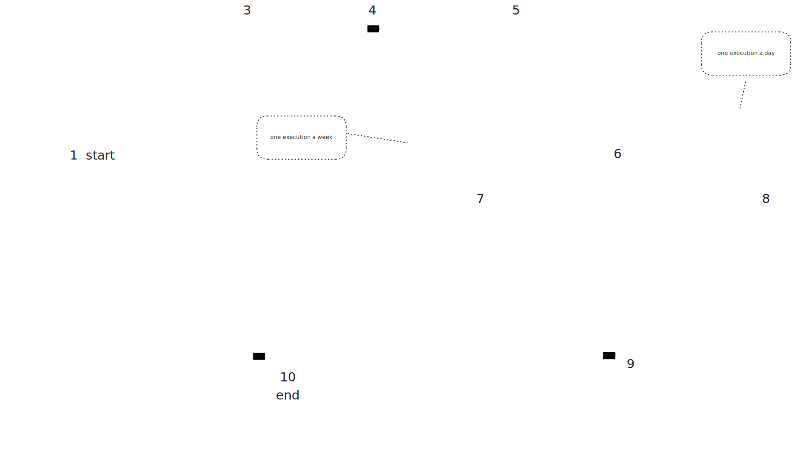

# pn-delayer
Repository contenente i componenti realizzati per gestire in modo efficiente i picchi di recapito in modo tale da non appesantire i recapitisti sulla base di spedizioni ricevute dalle notifiche create dagli enti mittenti.

## Panoramica
Si compone di:

- AWS **Lambda**:
    - **pn-delayer-kinesisPaperDeliveryLambda**: gestisce la ricezione degli eventi Kinesis relativi alla prepare fase 1 e la scrittura sulla tabella `Pn-PaperDeliveryHighPriority`
    - **pn-delayer-submitPaperDeliveryJobLambda**: Si occupa della submit dei Job di schedulazione spedizioni
    - **pn-delayer job**: Job di schedulazione spedizioni sulla base delle capacità dei recapitisti
    - **pn-delayerToPaperChannelLambda**: responsabile della lettura dalla tabella `Pn-PaperDeliveryReadyToSend` e scrittura sulla coda `pn-delayer_to_paperchannel`.
    - **pn-delayerToPaperChannelRecoveryLambda**: Ha un comportamento analogo alla lambda precedente ma ha l'opzione di scegliere una data da usare come chiave primaria per la lettura sulla tabella `Pn-PaperDeliveryReadyToSend`.

### Architettura

https://excalidraw.com/#json=PAngScUbYCWtPF1bxyJJh,EoCtsGXgj2bPM9hr7rgh3A

## Pn-delayer-kinesisPaperDeliveryLambda
### Responsabilità
- Lettura degli eventi del Kinesis Data Stream `pn-delayer_inputs` relativi alla prepare fase 1
- Inserimento di tali eventi sulla tabella `Pn-PaperDeliveryHighPriority`

### Configurazione
| Variabile Ambiente         | Descrizione                                                                  | Obbligatorio | Default |
|----------------------------|------------------------------------------------------------------------------|--------------|---------|
| `REGION`                   |                                                                              | Sì           |         |
| `HIGH_PRIORITY_TABLE_NAME` | Nome della tabella DynamoDB per la gestione delle notifiche ad alta priorità | Sì           |         |
| `BATCH_SIZE`               | Dimensione massima del batch per l'elaborazione delle notifiche              | No           | 25      |


## Pn-delayer-submitPaperDeliveryJobLambda
### Responsabilità
- recupero di tutti gli `unifiedDeliveryDriver` e delle province associate
- sottomissione di un numero di `AWS Job Array` pari al numero degli `unifiedDeliveryDriver` recuperati, ognuno avente un numero di `child job` pari al numero di province associate al recapitista.

### Configurazione
| Variabile Ambiente                 | Descrizione                                                                                           | Obbligatorio |
|------------------------------------|-------------------------------------------------------------------------------------------------------|--------------|
| `REGION`                           |                                                                                                       | Sì           |
| `JOB_QUEUE`                        | Arn della coda di Job pn-delayer-job-queue                                                            | Sì           |
| `JOB_DEFINITION`                   | Arn della Job definition pn-delayer-job-definition                                                    | Sì           |
| `JOB_INPUT_PARAMETER`              | SSM parameter name for SubmitPaperDeliveryJob input tuples                                            | Sì           |  
| `JOB_INPUT_DRIVER_ENV_NAME`        | Nome della env per l'unifiedDeliveryDriver input del job (PN_DELAYER_JOBINPUT_UNIFIEDDELIVERYDRIVER)  | Sì           |  
| `JOB_INPUT_PROVINCE_LIST_ENV_NAME` | Nome della env per la lista di province input del job (PN_DELAYER_JOBINPUT_PROVINCELIST)              | Sì           |  


## Pn-delayer JOB
### Responsabilità
- recupero spedizioni dalla tabella pn-PaperDeliveryHighPriority
- verifica della capacità per le coppie recapitista-provincia e recapitista-cap nella settimana in cui la spedizione dovrebbe essere schedulata
- calcolo della deliveryDate per ogni spedizione basata sul cut-off e sull'intervallo di schedulazione
- inserimento degli item pronti per essere inviati alla prepare fase 2 nella tabella pn-paperDeliveryReadyToSend

### Configurazione
| Variabile Ambiente                                          | Descrizione                                                           | Obbligatorio | Default |
|-------------------------------------------------------------|-----------------------------------------------------------------------|--------------|---------|
| `PN_DELAYER_DAO_PAPERDELIVERYDRIVERCAPACITIESTABLENAME`     | tabella per le capacità settimanale dei recapitisti                   | Si           |         |
| `PN_DELAYER_DAO_PAPERDELIVERYDRIVERUSEDCAPACITIESTABLENAME` | tabella per il numero di spedizioni settimanali effettuate            | Si           |         |
| `PN_DELAYER_DAO_PAPERDELIVERYHIGHPRIORITYTABLENAME`         | tabella per le spedizioni da affidare                                 | Si           |         |
| `PN_DELAYER_DAO_PAPERDELIVERYREADYTOSENDTABLENAME`          | tabella per le spedizioni pronte per la prepare fase 2                | Si           |         |
| `PN_DELAYER_HIGHPRIORITYQUERYLIMIT`                         | Limite per la query sulla tabella Pn-PaperDeliveryHighPriority        | Si           | 1000    |
| `PN_DELAYER_DELIVERYDATEDAYOFWEEK`                          | Primo giorno della settimana di cut-off (0=Dom, 1=Lun, ...)           | Si           | 1       |
| `PN_DELAYER_DELIVERYDATEINTERVAL`                           | Intervallo di schedulazione delle spedizioni all'interno del cut-off  | Si           | 1d      |
| `AWS_REGIONCODE`                                            |                                                                       | Si           |         |
| `PN_DELAYER_JOBINPUT_UNIFIEDDELIVERYDRIVER`                 | UnifiedDeliveryDriver di input per il JOB                             | Si           |         |
| `PN_DELAYER_JOBINPUT_PROVINCELIST`                          | Province relative all'unifiedDeliveryDriver di input per il JOB       | Si           |         |
| `PN_DELAYER_PAPERDELIVERYCUTOFFDURATION`                    | Durata del cut-off (es. 7 - settimanale, 0 - cutoff spento)           | Si           | 7d      |


## Pn-delayerToPaperChannelLambda
Lambda schedulata dalla regola event bridge `pn-delayerToPaperChannelScheduleRule`.
### Responsabilità
- recupero delle spedizioni, schedulate nella data di esecuzione della lambda, dalla tabella `Pn-PaperDeliveryReadyToSend`
- invio delle spedizioni recuperate sulla coda `pn-delayer_to_paperchannel`

### Configurazione
| Variabile Ambiente                    | Descrizione                                                        | Obbligatorio |Default |
|---------------------------------------|--------------------------------------------------------------------|--------------|--------|
| `REGION`                              |                                                                    | Sì           |        |
| `PAPERDELIVERYREADYTOSEND_TABLENAME`  | Tabella per le spedizioni pronte per la prepare fase 2             | Sì           |        |
| `PAPERDELIVERYREADYTOSEND_QUERYLIMIT` | Limite per la query sulla tabella Pn-PaperDeliveryReadyToSend      | No           | 1000   |
| `DELAYERTOPAPERCHANNEL_QUEUEURL`      | URL della coda per la prepare fase 2 (pn-delayer_to_paperchannel)  | Sì           |        |


## Pn-delayerToPaperChannelRecoveryLambda
Lambda, schedulata dalla regola event bridge `pn--DelayerToPaperChannelRecoveryScheduleRule`.
### Responsabilità
- recupero delle spedizioni, schedulate nella data definita dalla env `PAPERDELIVERYREADYTOSEND_RECOVERYDELIVERYDATE` o se non presente nel giorno precedente alla data di esecuzione della lambda, dalla tabella `Pn-PaperDeliveryReadyToSend`
- invio delle spedizioni recuperate sulla coda `pn-delayer_to_paperchannel`

### Configurazione
| Variabile Ambiente                              | Descrizione                                                     | Obbligatorio | Default |
|-------------------------------------------------|-----------------------------------------------------------------|--------------|---------|
| `REGION`                                        | Regione AWS in cui è deployato il microservizio                 | Sì           |         |
| `PAPERDELIVERYREADYTOSEND_TABLENAME`            | Nome della tabella DynamoDB per le notifiche pronte per l'invio | Sì           |         |
| `PAPERDELIVERYREADYTOSEND_QUERYLIMIT`           | Limite massimo di elementi da recuperare per query              | No           | 1000    |
| `DELAYERTOPAPERCHANNEL_QUEUEURL`                | URL della coda SQS per l'invio delle notifiche ai recapitisti   | Sì           |         |
| `PAPERDELIVERYREADYTOSEND_RECOVERYDELIVERYDATE` | Data di recupero per le notifiche non inviate                   | No           | ''      |


## Test
**Premessa**
- Non è possibile eseguire in locale il JOB automaticamente partendo dalla sua invocazione dalla lambda `Pn-delayer-submitPaperDeliveryJobLambda` sarà quindi necessario avviare manualmente il microservizio in locale passando le env necessarie per l'esecuzione.
- Prima di eseguire un test completo è necessario lanciare lo script `src\test\resources\insert_capacity.sh` per popolare la tabella `pn-PaperDeliveryDriverCapacities`.
  ``` 
  .\insert_capacity.sh <capProvinceMap> <capacity>
  ```
  parametri:
  - **capProvinceMap** = opzionale - lista di cap e province (geoKey) da censire (formato 00100=RM,20121=MI) - default:  
        ``` 
          87100=CS
          00118=RM
          20121=MI
          80122=NA
          80121=NA
          10121=TO
          09131=CA
          50121=FI
          50122=FI
        ```
  - **capacity** = opzionale - capacità da censire per tutte le geoKey specificiate - default = 7

### Step
#### 1. Esecuzione della lambda `Pn-delayer-kinesisPaperDeliveryLambda`
**Premessa**
 - Prima di eseguire il test è necessario eseguire lo script `generate_kinesis_event.sh` passando in input un json contenente una lista di messaggi provenienti dalla prepare fase 1 
   che si vuole utilizzare per generare la lista di eventi, se il nuovo json non dovesse essere passato allo script sarà utilizzato il file di `default.json` contenente 3 messaggi di
   esempio della prepare fase 1:

   esempio messages.json:
   ```
   [
    {
      requestId: string,
      iun: string,
      productType: string,
      senderPaId: string,
      recipientId: String,
      unifiedDeliveryDriver: string,
      tenderId: string,
      recipientNormalizedAddress:{
        cap: string,
        pr: string  
      }
    }
   ] 
   ```

   eseguire il comando:
   ```
    .\generate_kinesis_event.sh.sh <filePath>
   ```

   parametri:
   - **filePath** = percorso del file json contenente la lista di payload dei messaggi della prepare fase 1 che si vogliono utilizzare

**Prerequisiti**:
- Avviare localstack con [l'init.sh ](https://github.com/pagopa/pn-delayer/blob/develop/src/test/resources/testcontainers/init.sh)
- Aggiunger il file `.env`:
  ```
  AWS_REGION=us-east-1
  REGION=us-east-1
  AWS_SECRET_ACCESS_KEY=PN-TEST
  AWS_ACCESS_KEY_ID=PN-TEST
  AWS_ENDPOINT_URL=http://localhost:4566
  HIGH_PRIORITY_TABLE_NAME=pn-PaperDeliveryHighPriority
  ```
- Aggiungere il seguente script all'interno del file `package.json`:
  ```json
  "integrazione": "nyc --reporter=html --reporter=text mocha './src/test/**/integration.test.js' --recursive --timeout=100000 --exit -r dotenv/config"
  ``` 
- Modifica del file integration.test.js rimuovendo `.skip` alla riga x

**Installazione delle dipendenze**:
- Spostarsi nella directory del modulo contenente la Lambda e installare le dipendenze:
  ```
  npm install
  ```
**Esecuzione del test**
- eseguire il comando
  ```
  npm run integrazione
  ```
**Verifiche**
- Accedere dalla console di localstack (https://app.localstack.cloud/inst/default/resources/dynamodb) alla tabella pn-PaperDeliveryHighPriority e verificare
   l'inserimento degli item e il popolamento dei seguenti attributi:
  ```
  {
    pk: <event.unifiedDeliveryDriver>##<message.recipientNormalizedAddress.pr>
    createdAt: Instant.now,
    requestId: <message.requestId>,
    productType: <message.productType>,
    cap: <message.recipientNormalizedAddress.cap>,
    province: <message.recipientNormalizedAddress.pr>,
    senderPaId: <message.senderPaId>,
    recipientId: <message.recipientId>,
    unifieddeliveryDriver: <message.unifiedDeliveryDriver>,
    tenderId: <message.tenderId>,
    iun: <message.iun>
  } 
  ```
#### 2. Esecuzione della lambda `Pn-delayer-submitPaperDeliveryJobLambda`

**//TODO**

#### 3. Avvio del microservizio `Pn-delayer`

N.B.
- Per poter eseguire questo test in locale è necessaria la presenza di item relativi alla capacità sulla tabella pn-PaperDeliveryDriverCapacities basati sui cap e le province presenti nelle spedizioni della tabella Pn-PaperDeliveryHighPriority.
- Se si vuole effettuare il test senza cut-off sarà necessario popolare la env PN_DELAYER_PAPERDELIVERYCUTOFFDURATION specificando il valore 0

**Prerequisiti**:
- Avviare localstack con [l'init.sh ](https://github.com/pagopa/pn-delayer/blob/develop/src/test/resources/testcontainers/init.sh)
- Popolare le seguenti env:
  ```
  AWS_REGIONCODE=us-east-1
  AWS_SECRET_ACCESS_KEY=PN-TEST
  AWS_ACCESS_KEY_ID=PN-TEST
  AWS_ENDPOINT_URL=http://localhost:4566
  PAPERDELIVERYREADYTOSEND_TABLENAME=pn-PaperDeliveryReadyToSend
  PN_DELAYER_DAO_PAPERDELIVERYHIGHPRIORITYTABLENAME=Pn-PaperDeliveryHighPriority
  PN_DELAYER_DAO_PAPERDELIVERYDRIVERUSEDCAPACITIESTABLENAME=pn-PaperDeliveryDriverUsedCapacities
  PN_DELAYER_DAO_PAPERDELIVERYDRIVERCAPACITIESTABLENAME=pn-PaperDeliveryDriverCapacities
  DELAYERTOPAPERCHANNEL_QUEUEURL=http://localstack:4566/000000000000/pn-delayer_to_paperchannel
  PN_DELAYER_JOBINPUT_UNIFIEDDELIVERYDRIVER=<specificare un unified deliver driver presente nelle spedizioni della tabella Pn-PaperDeliveryHighPriority>
  PN_DELAYER_JOBINPUT_PROVINCELIST=<specificare una lista di province (sigla) contenente necessariamente le province presenti nelle spedizioni della tabella Pn-PaperDeliveryHighPriority ma anche province per le quali non sono presenti spedizioni per testare i vari scenari>
  ```

**Esecuzione del test**
- eseguire il run dell'applicativo

**Verifiche**
- Le spedizioni presenti nella tabella pn-PaperDeliveryHighPriority per le quali è presente capacità dovranno essere spostate nella tabella pn-PaperDeliveryReadyToSend impostando la data di spedizione basata sulle env PN_DELAYER_DELIVERYDATEDAYOFWEEK, PN_DELAYER_DELIVERYDATEINTERVAL e PN_DELAYER_PAPERDELIVERYCUTOFFDURATION
- Le spedizioni presenti nella tabella pn-PaperDeliveryHighPriority per le quali non è presente capacità non dovranno subire modifiche e rimarranno sulla tabella fino a che non sarà possibile schedularle.

#### 4. Esecuzione della lambda `Pn-delayerToPaperChannelLambda`
N.B. il json event.json contiente un evento vuoto in quanto tale lambda è schedulata e non lavora con eventi specifici

Passaggi necessari per eseguire i test di integrazione:

**Prerequisiti**:
- Avviare localstack con [l'init.sh ](https://github.com/pagopa/pn-delayer/blob/develop/src/test/resources/testcontainers/init.sh)
- Aggiunger il file `.env`:
  ```
  AWS_REGION=us-east-1
  REGION=us-east-1
  AWS_SECRET_ACCESS_KEY=PN-TEST
  AWS_ACCESS_KEY_ID=PN-TEST
  AWS_ENDPOINT_URL=http://localhost:4566
  PAPERDELIVERYREADYTOSEND_TABLENAME=pn-PaperDeliveryReadyToSend
  DELAYERTOPAPERCHANNEL_QUEUEURL=http://localstack:4566/000000000000/pn-delayer_to_paperchannel
  ```
- Aggiungere il seguente script all'interno del file `package.json`:
  ```json
  "integrazione": "nyc --reporter=html --reporter=text mocha './src/test/**/integration.test.js' --recursive --timeout=100000 --exit -r dotenv/config"
  ``` 
- Modifica del file integration.test.js rimuovendo `.skip` alla riga x

**Installazione delle dipendenze**:
- Spostarsi nella directory del modulo contenente la Lambda e installare le dipendenze:
  ```
  npm install
  ```
**Esecuzione del test**
- eseguire il comando
  ```
  npm run integrazione
  ```
**Verifiche**
- Accedere dalla console di localstack (https://app.localstack.cloud/inst/default/resources/dynamodb) alla tabella pn-PaperDeliveryReadyToSend e verificare che tutti gli item aventi pk(deliveryDate) pari alla data di esecuzione della lambda siano stati correttamente cancellati.
- Verificare sempre sulla console di localstack (https://app.localstack.cloud/inst/default/resources/sqs) la presenza di un numero di messaggi sulla coda pn-delayer_to_paperchannel pari al numero di item cancellati. il payload dei messaggi dovrà avere la seguente struttura:
  ```
  {
    requestId: <item.requestId>,
    iun: <item.iun>,
    attemptRetry: 0
  }
  ```

#### 5. Esecuzione della lambda `Pn-delayerToPaperChannelRecoveryLambda`
N.B il json event.json contiente un evento vuoto in quanto tale lambda è schedulata e non lavora con eventi specifici
Per questa lambda è possibile simulare due scenari:
- env `PAPERDELIVERYREADYTOSEND_RECOVERYDELIVERYDATE` popolata per indicare quali spedizioni recuperare e inviare alla fase due
- env `PAPERDELIVERYREADYTOSEND_RECOVERYDELIVERYDATE` non popolata, per recuperare le spedizioni schedulate un giorno prima della data di esecuzione della lambda non correttamente elaborate dalla lambda `Pn-delayerToPaperChannelLambda`

Passaggi necessari per eseguire i test di integrazione:

**Prerequisiti**:
- Avviare localstack con [l'init.sh ](https://github.com/pagopa/pn-delayer/blob/develop/src/test/resources/testcontainers/init.sh)
- Aggiunger il file `.env`:
  ```
  AWS_REGION=us-east-1
  REGION=us-east-1
  AWS_SECRET_ACCESS_KEY=PN-TEST
  AWS_ACCESS_KEY_ID=PN-TEST
  AWS_ENDPOINT_URL=http://localhost:4566
  PAPERDELIVERYREADYTOSEND_TABLENAME=pn-PaperDeliveryReadyToSend
  DELAYERTOPAPERCHANNEL_QUEUEURL=http://localstack:4566/000000000000/pn-delayer_to_paperchannel
  ?PAPERDELIVERYREADYTOSEND_RECOVERYDELIVERYDATE=2025-01-01T00:00:00Z
  ```
- Aggiungere il seguente script all'interno del file `package.json`:
  ```json
  "integrazione": "nyc --reporter=html --reporter=text mocha './src/test/**/integration.test.js' --recursive --timeout=100000 --exit -r dotenv/config"
  ``` 
- Modifica del file integration.test.js rimuovendo `.skip` alla riga x

**Installazione delle dipendenze**:
- Spostarsi nella directory del modulo contenente la Lambda e installare le dipendenze:
  ```
  npm install
  ```
**Esecuzione del test**
- eseguire il comando
  ```
  npm run integrazione
  ```

**Verifiche**
- Accedere dalla console di localstack (https://app.localstack.cloud/inst/default/resources/dynamodb) alla tabella pn-PaperDeliveryReadyToSend e verificare che tutti gli item aventi pk(deliveryDate) pari a `PAPERDELIVERYREADYTOSEND_RECOVERYDELIVERYDATE` o a `Date.now() - 1d` siano stati correttamente cancellati.
- Verificare sempre sulla console di localstack (https://app.localstack.cloud/inst/default/resources/sqs) la presenza di un numero di messaggi sulla coda pn-delayer_to_paperchannel pari al numero di item cancellati. il payload dei messaggi dovrà avere la seguente struttura:
  ```
  {
    requestId: <item.requestId>,
    iun: <item.iun>,
    attemptRetry: 0
  }
  ```


 
