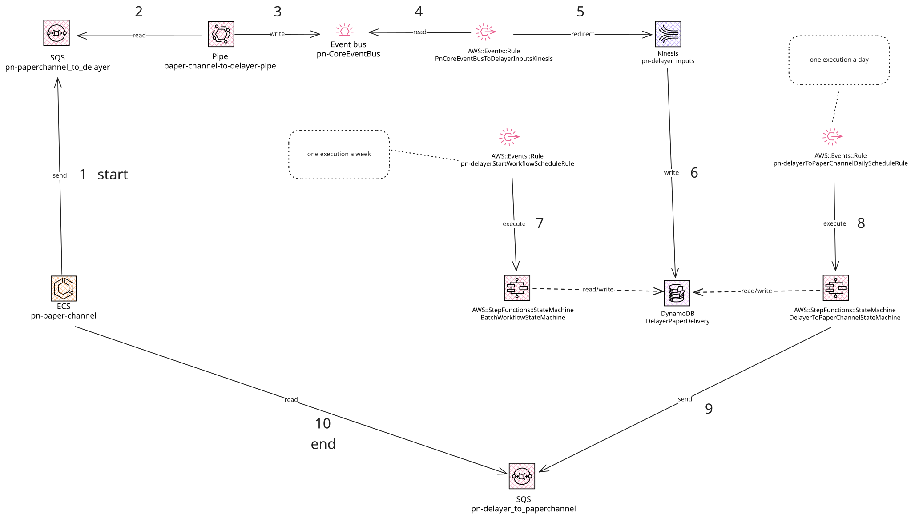

# pn-delayer

## Indice
- [Descrizione](#descrizione)
- [Tecnologie Utilizzate](#tecnologie-utilizzate)
- [Architettura](#architettura)
- [Interfacce del Servizio](#interfacce-del-servizio)
- [Configurazioni](#configurazioni)
- [Allarmi e Monitoraggio](#allarmi-e-monitoraggio)
- [Esecuzione](#esecuzione)

## Descrizione

Il servizio `pn-delayer` gestisce la pianificazione delle spedizioni cartacee SEND per ridurre i picchi operativi, applicando in sequenza la priorita mittente, 
i limiti garantiti per provincia/prodotto, la capacità di recapito e la capacità di stampa. 
La soluzione è composta da un batch Spring Boot eseguito su AWS Batch (step `EVALUATE_SENDER_PRIORITY`, `EVALUATE_SENDER_LIMIT`, `EVALUATE_DRIVER_CAPACITY`, `EVALUATE_RESIDUAL_CAPACITY`) 
e da Lambda di supporto che ingestano eventi in ingresso, preparano dati di stima, orchestrano pre-run/retry e inviano le spedizioni verso la prepare phase 2 tramite coda.

## Tecnologie Utilizzate

### Stack Tecnologico
* Java 25
* Spring Boot 3
* AWS SDK for Java v2
* Node.js (package Lambda con engine `>=20`)
* AWS SDK for JavaScript v3

### Infrastruttura
* AWS Batch (job di pianificazione)
* AWS Lambda
* AWS Step Functions
* AWS DynamoDB
* AWS Kinesis Data Streams
* AWS SQS
* AWS EventBridge
* AWS Systems Manager Parameter Store

## Architettura

Il flusso principale prevede ingest da EventBridge/Kinesis verso `pn-DelayerPaperDelivery`, esecuzione settimanale della state machine batch per la pianificazione, e una state machine giornaliera che applica la capacità di stampa e invia le spedizioni al downstream paper channel o le ripianifica alla settimana successiva.



> [Sorgente Diagramma](Architettura.svg)

[**Architettura interna**](docs/ms/architettura_interna.md)

## Interfacce del Servizio

| Tipo  | Dir | Risorsa                                 | Protocollo  | Metodo  | Route                                                  | Descrizione                                                                                                                     |
|-------|-----|-----------------------------------------|-------------|---------|--------------------------------------------------------|---------------------------------------------------------------------------------------------------------------------------------|
| EVENT | IN  | `PreparePhaseOneOutcomeEvent`           | EventBridge | PUBLISH | `detail-type=PreparePhaseOneOutcomeEvent`              | Evento di prepare phase 1 instradato verso `pn-delayer_inputs` e poi consumato da `kinesisPaperDeliveryLambda`.                 |
| EVENT | IN  | `SafeStorageOutcomeEvent`               | EventBridge | PUBLISH | `detail-type=SafeStorageOutcomeEvent`                  | Evento SafeStorage usato per alimentare le code verso `delayerReceiverOrdersSendersLambda` e `delayerNotificationOrdersLambda`. |
| EVENT | IN  | `safestorage_to_delayer_orders_senders` | SQS         | CONSUME | `${ProjectName}-safestorage_to_delayer_orders_senders` | Coda consumata dalla Lambda che aggiorna le stime mittente (`PaperDeliverySenderLimit`).                                        |
| EVENT | IN  | `safestorage_to_notification_orders`    | SQS         | CONSUME | `${ProjectName}-safestorage_to_notification_orders`    | Coda consumata dalla Lambda che persiste i moduli commessa originari.                                                           |
| EVENT | OUT | `delayer_to_paperchannel`               | SQS         | PRODUCE | `${ProjectName}-delayer_to_paperchannel`               | Coda popolata da `delayerToPaperChannelLambda` per inviare le spedizioni verso prepare phase 2.                                 |

## Configurazioni

Per il dettaglio delle configurazioni si rimanda al file [**Architettura interna**](docs/ms/architettura_interna.md)

## Allarmi e Monitoraggio

| Tipo      | Nome                                                               | Descrizione                                                                                  |
|-----------|--------------------------------------------------------------------|----------------------------------------------------------------------------------------------|
| DASHBOARD | `${ProjectName}-delayer`                                           | Dashboard CloudWatch con metriche principali di DynamoDB e job batch.                        |
| ALARM     | `${ProjectName}-BatchWorkflowStateMachine-FailedAlarm`             | Allarme su failure invocations del rule EventBridge associato alle state machine principali. |
| ALARM     | `${ProjectName}-delayer-sender-limit-job-ErrorFatalLogs-Alarm`     | Allarme su log `ERROR/FATAL/CRITICAL` del job sender-limit.                                  |
| ALARM     | `${ProjectName}-delayer-driver-capacity-job-ErrorFatalLogs-Alarm`  | Allarme su log `ERROR/FATAL/CRITICAL` del job driver-capacity.                               |
| ALARM     | `${ProjectName}-delayer-residual-capacity-ErrorFatalLogs-Alarm`    | Allarme su log `ERROR/FATAL/CRITICAL` del job residual-capacity.                             |
| LOG       | `/aws/lambda/${ProjectName}-delayer-kinesisPaperDeliveryLambda`    | Log group della Lambda di ingest per troubleshooting su eventi in ingresso.                  |

## Esecuzione

### Prerequisiti

* JDK 25
* Docker o Podman attivo per test con LocalStack
* Node.js 20+ per i package Lambda

### Build e avvio locale

```bash
./mvnw clean package
./mvnw spring-boot:run
```

### Test

```bash
./mvnw test
./mvnw -Dtest=EvaluateSenderLimitJobServiceTest test
./mvnw -Dtest=EvaluateSenderLimitJobServiceTest#startSenderLimitJob_singleDriver_withoutLastEvaluatedKey test
./mvnw -Dtest=PaperDeliveryDaoIT test
```

```bash
cd functions/kinesisPaperDeliveryLambda
npm install
npm test
npm run build
```

```bash
cd functions/delayerToPaperChannelLambda
npm install
npm test
npm run integrazione
```

I dettagli sui test di integrazione e le procedure di testing sono disponibili in [README_TEST.md](./README_TEST.md).


 
