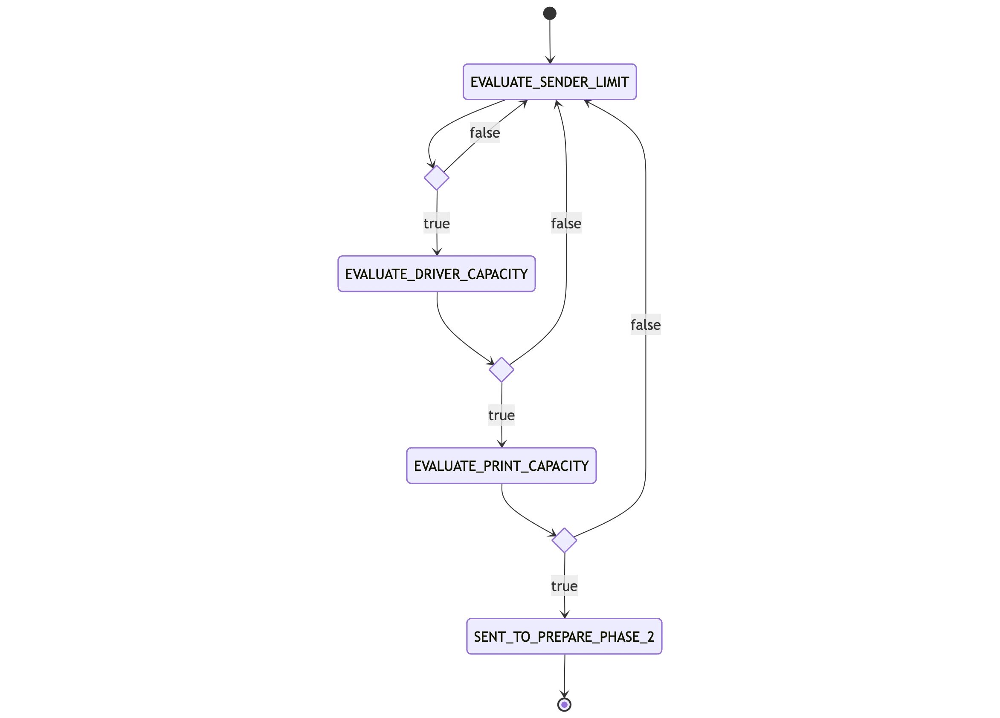

## Panoramica
Si compone di:
- AWS **Step Functions**:
    - **BatchWorkflowStateMachine**: definisce il workflow di pianificazione delle spedizioni coordinando l'esecuzione
      dei job di valutazione dei limiti garantiti al mittente, della capacità di recapito settimanali, e dei residui delle capacità di recapito settimanale. (1 volta a settimana il Lunedì)
    - **DelayerToPaperChannelStateMachine**: definisce il workflow di valutazione della capacità di stampa giornaliera e l'invio delle spedizioni alla prepare fase 2. (tutti i giorni 1 volta al giorno)
- AWS **Lambda**:
    - **pn-delayer-kinesisPaperDeliveryLambda**: gestisce la ricezione degli eventi Kinesis relativi alla prepare fase 1
      e la scrittura sulle tabelle `pn-DelayerPaperDelivery` e `pn-PaperDeliveryCounters`.
    - **pn-delayer-submitPaperDeliveryJobLambda**: si occupa della submit dei job di schedulazione spedizioni.
      Viene lanciata dalla Step Function `BatchWorkflowStateMachine`.
    - **pn-delayerToPaperChannelLambda**: responsabile della lettura delle spedizioni con
      `workflowStep = EVALUATE_PRINT_CAPACITY` dalla tabella `pn-DelayerPaperDelivery` e della scrittura
      sulla coda `pn-delayer_to_paperchannel`. Viene lanciata dalla Step Function `DelayerToPaperChannelStateMachine`.
    - **pn-delayer-receiverOrdersSendersLambda**: consuma gli eventi SafeStorage relativi al caricamento dei
      moduli commessa e censisce le stime dei mittenti per provincia e prodotto.
    - **pn-delayer-notificationOrdersLambda**: consuma gli eventi SafeStorage relativi al caricamento dei
      moduli commessa e persiste i moduli commessa originari
    - **pn-kinesisNotificationCancellationLambda**: gestisce gli eventi di cancellazione e di visualizzazione delle spedizioni
      al fine di escluderli dalla pianificazione se possibile.
    - **pn-exportDelayerDataLambda** / **pn-exportDryRunDashboardDataLambda**: esportano dati dal Delayer.
    - **pn-preRunAlgorithmLambda** : operazioni di pre-run prima dell'esecuzione dell'algoritmo di pianificazione.
    - **pn-preRunRetryLambda**: operazioni di pre-run prima dell'esecuzione del retry dell'algoritmo di pianificazione.
    - **pn-switchOffAlgorithmLambda**: si occupa, in seguito alla disabilitazione della feature dell'invio di tutte le spedizioni
      congelate e non ancora pianificate alla prepare fase 2.
    - **pn-sentPaperDeliveryToPreparePhaseTwoLambda**: si occupa dello sblocco manuale delle spedizioni congelate ricevute
      in input eseguendo l'invio dele stesse alla prepare fase 2.
    - **pn-testDelayerLambda**: dispatcher per operazioni di test (usata da QA e dal simulatore)
- Microservizio Spring Boot 3
    - **pn-delayer**: contiene i job di valutazione della priorità mittente, dei limiti garantiti al mittente
      e delle capacità di recapito settimanali. A seconda del valore della variabile `PN_DELAYER_WORKFLOWSTEP`
      avvia il job corrispondente:

| WorkFlowStep                 | Descrizione                                                                                         |
|------------------------------|-----------------------------------------------------------------------------------------------------|
| `EVALUATE_SENDER_PRIORITY`   | Avvia il job di riordino delle spedizioni per priorità mittente                                     |
| `EVALUATE_SENDER_LIMIT`      | Avvia il job di valutazione del limite settimanale garantito al mittente                            |
| `EVALUATE_DRIVER_CAPACITY`   | Avvia il job di valutazione della capacità di recapito settimanale (primo passaggio, cap specifico) |
| `EVALUATE_RESIDUAL_CAPACITY` | Avvia il job di valutazione dei residui di capacità di recapito settimanale                         |

Per le spedizioni in eccesso, cioè che superano:
- "definitivamente" i limiti garantiti (cioè, che non possono essere recuperate dal batch dei residui perché non vi è capacità di recapito residua)
- le capacità di recapito
- "definitivamente" le capacità di stampa (cioè, non c'è capacità di stampa nell'ultimo giorno della settimana)

vengono creati i record nella tabella `pn-DelayerPaperDelivery` con `workflowStep = EVALUATE_SENDER_LIMIT` e deliveryDate alla settimana successiva, in modo tale da essere valutati
alla prossima esecuzione settimanale della Step Function `BatchWorkflowStateMachine`.

### Workflow delle spedizione nell’algoritmo di pianificazione

Siccome l’algoritmo prevede la valutazione dei seguenti step:
- Valutazione limite settimanale garantito al mittente.
- Valutazione capacità di recapito settimanale.
- Valutazione capacità di stampa giornaliera.

ogni spedizione potrà subire i seguenti cambi di stati durante l’esecuzione dell’algoritmo:


### Pn-delayer-kinesisPaperDeliveryLambda
#### Responsabilità
- Lettura degli eventi del Kinesis Data Stream `pn-delayer_inputs` relativi alla prepare fase 1
- Inserimento di tali eventi sulle tabelle `pn-DelayerPaperDelivery` e `pn-PaperDeliveryCounters`
- 
#### Valutazione delle spedizioni ritardate dal sistema

Le spedizioni arrivate in ritardo al Delayer (ad esempio a seguito di messaggi di cortesia),
vengono valutate rispetto alla disponibilità residua della stima settimanale del mittente per la relativa settimana di spedizione.
Se la disponibilità residua è positiva, e per la settimana di riferimento non è stata consumata tutta la quota disponibile, 
la lambda job valorizza `skipSenderLimit = true` e incrementa la quota mittente utilizzata.


#### Configurazione
| Variabile Ambiente                          | Descrizione                                                                                                                                      | Obbligatorio | Default |
|---------------------------------------------|--------------------------------------------------------------------------------------------------------------------------------------------------|--------------|---------|
| KINESIS_PAPERDELIVERY_TABLE                 | Nome della tabella DynamoDB contenente il workflow delle richieste di spedizione elaborate dall'algoritmo di pianificazione                      | Sì           |         |
| KINESIS_PAPERDELIVERY_COUNTERTABLE          | Nome della tabella DynamoDB per i contatori di RS e Secondi tentativi, il contatore della capacità di stampa, e i contatori dei moduli commessa  | Sì           |         |
| KINESIS_PAPERDELIVERY_SENDERLIMITTABLE      | Nome della tabella DynamoDB contenente le stime dei mittenti                                                                                     | Sì           |         |
| KINESIS_PAPERDELIVERY_EVENTTABLE            | Nome della tabella DynamoDB per i record degli eventi Kinesis già elaborati                                                                      | Sì           |         |
| KINESIS_PAPERDELIVERY_DELIVERYDATEDAYOFWEEK | Giorno iniziale per la settimana di cutOff                                                                                                       | No           | 1       |
| KINESIS_PAPERDELIVERY_COUNTERTTLDAYS        | TTL in giorni per i contatori                                                                                                                    | No           | 14      |
| KINESIS_EVENTSRECORDTTLSECONDS              | TTL in secondi per i record degli eventi Kinesis                                                                                                 | Sì           |         |
| KINESIS_BATCHSIZE                           | Dimensione massima del batch per l'elaborazione delle notifiche                                                                                  | No           |         |

### pn-delayer-sender-priority-job

#### Responsabilità
* Recupera le spedizioni di uno specifico mittente che si trovano nello step `EVALUATE_SENDER_LIMIT` per una determinata settimana di consegna.
* Riordina le spedizioni in base alla priorità assegnata dal mittente, mantenendo invariato l'insieme delle date di ordinamento originarie.
* Assegna le date di ordinamento più vecchie alle spedizioni con priorità più alta, in modo che vengano elaborate per prime nei job successivi.
* Aggiorna la sort key delle spedizioni (eliminando il vecchio record e inserendo quello con la nuova sort key in transazione) nella `PaperDeliveryTable`.

#### Riordinamento per priorità del mittente

Per ogni spedizione recuperata, il job legge:
```text
senderPriority
senderPaIdOriginalSentAt
```

Il campo `senderPaIdOriginalSentAt` ha il formato:
```text
senderPaId~originalSentAt
```

Da questo valore viene estratto `originalSentAt`, che rappresenta la data di ordinamento originaria della spedizione.
Le date originarie vengono raccolte mantenendo l'ordine restituito dalla query, mentre le spedizioni vengono raggruppate per `senderPriority` in ordine decrescente:

```text
priorità più alta
priorità più bassa
```

Il job non genera nuove date di ordinamento, ma riassegna alle spedizioni prioritarie le date già associate all'insieme delle spedizioni recuperate.
Il riordinamento può essere rappresentato come segue:

```text
originalOrderedDates = date originarie ordinate in modo crescente
deliveriesByPriority = spedizioni raggruppate per priorità decrescente

per ogni priorità, dalla più alta alla più bassa:
    per ogni spedizione appartenente alla priorità:
        assegna la prima data originaria ancora disponibile
```

In questo modo le spedizioni con priorità maggiore ricevono le date di ordinamento più vecchie e risultano quindi antecedenti alle spedizioni con priorità inferiore.

#### Esempio

Date di ordinamento originarie:

```text
Spedizione A:
senderPriority = 0
notificationSentAt = 2026-07-01T10:00:00Z

Spedizione B:
senderPriority = 50
notificationSentAt = 2026-07-01T11:00:00Z

Spedizione C:
senderPriority = 100
notificationSentAt = 2026-07-01T12:00:00Z
```

Dopo il riordinamento:

```text
Spedizione C:
senderPriority = 100
virtualNotificationSentAt = 2026-07-01T10:00:00Z

Spedizione B:
senderPriority = 50
virtualNotificationSentAt = 2026-07-01T11:00:00Z

Spedizione A:
senderPriority = 0
virtualNotificationSentAt = 2026-07-01T12:00:00Z
```

Le date disponibili rimangono quindi le stesse, ma vengono riassegnate in funzione della priorità del mittente.
Il valore di `virtualNotificationSentAt` rappresenta quindi la data effettiva utilizzata per ordinare la spedizione dopo l'applicazione della priorità del mittente.
Se per il mittente e la settimana indicati non sono presenti spedizioni da riordinare, il job termina senza effettuare operazioni.


### pn-delayer-sender-limit-job

#### Responsabilità
- Recupera le spedizioni che si trovano nello step EVALUATE_SENDER_LIMIT per la settimana corrente.
- Calcola il limite settimanale garantito al mittente basato sulle percentuali garantite dai moduli commessa, applicate alla capacità di recapito settimanale al netto di RS, secondi tentativi e spedizioni ritardate dal sistema appartenenti al cluster prioritario (`skipSenderLimit == true`).
- Per tutte le spedizioni valuta la disponibilità residua della stima settimanale del mittente.
- Smista le spedizioni tra gli step EVALUATE_DRIVER_CAPACITY (spedizioni che rientrano nel limite garantito al mittente, RS, secondi tentativi
  e spedizioni ritardate dal sistema che fanno parte del cluster prioritario) e EVALUATE_RESIDUAL_CAPACITY (spedizioni che eccedono il limite garantito al mittente)
- In fase di inserimento delle spedizioni negli step successivi, se la spedizione non appartiene già al cluster prioritario
  valuta se la spedizione rientra nel modulo commessa per la settimana corrente - 1, e in caso affermativo, 
  la spedizione viene inserita nel cluster prioritario (`skipSenderLimit == true`), così che qualora fosse posticipata alla settimana successiva, salterebbe il controllo del limite garantito.
- Legge dalle tabelle: PaperDeliveryCounterTable, PaperDeliverySenderLimitTable, PaperDeliveryUsedSenderLimitTable, PaperDeliveryDriverCapacitiesTable, PaperDeliveryTable
- Scrive sulle tabelle DynamoDB: PaperDeliveryUsedSenderLimitTable

#### Calcolo limite garantito al mittente

Il limite garantito al mittente viene calcolato in `SenderLimitUtils.retrieveCapacityAndCalculateLimit` come quota proporzionale
della capacità disponibile del gruppo di recapitisti associato al prodotto.

Per ogni tupla `paId~productType~province` presente in `PaperDeliverySenderLimit`:

```text
driver = primo DriversTotalCapacity che contiene productType
relevantProducts = driver.products - ["RS"]

se relevantProducts contiene più di un prodotto:
    totalEstimate = somma totalEstimateCounter[prodotto] per tutti i relevantProducts
altrimenti:
    totalEstimate = totalEstimateCounter[productType]

se totalEstimate == 0:
    limit = 0
altrimenti:
    limit = floor(driver.capacity * weeklyEstimate / totalEstimate)
```

Dove:
- `weeklyEstimate` è la stima settimanale del mittente per prodotto e provincia.
- `totalEstimateCounter` contiene le stime totali provinciali per prodotto, recuperate dai contatori `SUM_ESTIMATES`.
- `driver.capacity` è la capacità disponibile del gruppo di recapitisti sulla provincia. Viene calcolata sommando le capacità
  dei recapitisti raggruppati per prodotti intersecanti e sottraendo gli eventuali contatori `EXCLUDE` relativi a RS e secondi tentativi
  e spedizioni ritardate dal sistema che fanno parte del cluster prioritario.
- `RS` non partecipa al denominatore del calcolo del limite garantito.

Esempio con un recapitista che gestisce un solo prodotto:

```text
Fulmine su RM:
products = [AR]
capacity = 500

totalEstimateCounter[AR] = 1000
weeklyEstimate PA1 AR = 120

limit = floor(500 * 120 / 1000) = 60
```

In questo caso PA1 ha 60 spedizioni AR garantite verso `EVALUATE_DRIVER_CAPACITY`; le spedizioni eccedenti vengono
indirizzate verso `EVALUATE_RESIDUAL_CAPACITY`.

Esempio con un recapitista che gestisce più prodotti:

```text
Poste su RM:
products = [AR, 890]
capacity = 600

totalEstimateCounter[AR] = 700
totalEstimateCounter[890] = 300
totalEstimate = 700 + 300 = 1000

weeklyEstimate PA1 AR = 140
limit PA1 AR = floor(600 * 140 / 1000) = 84

weeklyEstimate PA2 890 = 50
limit PA2 890 = floor(600 * 50 / 1000) = 30
```

Quando il recapitista gestisce più prodotti, il denominatore non è la sola stima del prodotto corrente, ma la somma delle
stime dei prodotti gestiti dal gruppo, escluso `RS`.

Esempio con due recapitisti che gestiscono lo stesso prodotto:

```text
Fulmine su PA:
products = [AR]
capacity = 300

Poste su PA:
products = [AR, 890]
capacity = 400
```

Poiché i prodotti si intersecano su `AR`, `DeliveryDriverUtils.groupDriversByIntersectingProducts` aggrega i due recapitisti:

```text
products = [AR, 890]
capacity = 300 + 400 = 700
unifiedDeliveryDrivers = [Fulmine, Poste]

totalEstimateCounter[AR] = 800
totalEstimateCounter[890] = 200
totalEstimate = 800 + 200 = 1000

weeklyEstimate PA1 AR = 160
limit PA1 AR = floor(700 * 160 / 1000) = 112

weeklyEstimate PA2 890 = 50
limit PA2 890 = floor(700 * 50 / 1000) = 35
```

In questo scenario il limite AR non viene calcolato sulla sola capacità di Fulmine o sulla sola capacità di Poste, ma sulla
capacità aggregata del gruppo `Fulmine + Poste`. Se invece entrambi i recapitisti gestissero solo `AR`, il gruppo avrebbe
`products = [AR]`, `capacity = 700` e il denominatore sarebbe solo `totalEstimateCounter[AR]`.

#### Configurazione
| Variabile Ambiente                                    | Descrizione                                                                                                                                    | Default | Obbligatorio |
|-------------------------------------------------------|------------------------------------------------------------------------------------------------------------------------------------------------|---------|--------------|
| PN_DELAYER_PAPERDELIVERYPRIORITYPARAMETERNAME         | Nome del parametro contenente l'ordine di priorità delle spedizioni                                                                            | -       | Si           |
| PN_DELAYER_DAO_PAPERDELIVERYQUERYLIMIT                | Query limit per la tabella contenente le spedizioni                                                                                            | 5       | No           |
| PN_DELAYER_DAO_PAPERDELIVERYCOUNTERTABLENAME          | Nome della tabella DynamoDB per i contatori di RS e Secondi tentativi, il contatore della capacità di stampa, e i contatori dei moduli commessa | -       | Si           |
| PN_DELAYER_DAO_PAPERDELIVERYSENDERLIMITTABLENAME      | Nome della tabella DynamoDB contenente le stime dei mittenti derivanti dai moduli commessa                                                     | -       | Si           |
| PN_DELAYER_DAO_PAPERDELIVERYUSEDSENDERLIMITTABLENAME  | Nome della tabella DynamoDB contenente le spedizioni inviate allo step successivo raggruppate per mittente-prodotto-provincia                  | -       | Si           |
| PN_DELAYER_DAO_PAPERDELIVERYDRIVERCAPACITIESTABLENAME | Nome della tabella DynamoDB per le capacità di recapito                                                                                        | -       | Si           |
| PN_DELAYER_DAO_PAPERDELIVERYTABLENAME                 | Nome della tabella DynamoDB contenente le spedizioni da valutare                                                                               | -       | Si           |
| PN_DELAYER_EVALUATESENDERLIMITJOBINPUT_PROVINCE       | Provincia di input per la singola esecuzione del JOB                                                                                           |         | No           |
| PN_DELAYER_ACTUALTENDERID                             | id della gara attiva                                                                                                                           |         | No           |
| PN_DELAYER_WORKFLOWSTEP                               | Workflow step = EVALUATE_SENDER_LIMIT                                                                                                          |         | No           |
| PN_DELAYER_PAPERCHANNELTENDERAPILAMBDAARN             | Nome della lambda di paperChannel per il recupero dei recapitisti                                                                              | -       | Si           |
| PN_DELAYER_DELIVERYDATEDAYOFWEEK                      | Giorno iniziale per la settimana di cutOff                                                                                                     | 1       | No           |
| PN_DELAYER_PRINTCAPACITY                              | capacità di stampa giornaliera nel formato '1970-01-01;180000'                                                                                 | -       | Si           |
| PN_DELAYER_ENABLEPRIORITYRESIDUALFLOW                 | Abilita il flusso prioritario residual nei job di pianificazione                                                                               | false   | Si           |

### pn-delayer-residual-capacity-job-definition

#### Responsabilità
- Recupera le spedizioni che si trovano nello step EVALUATE_RESIDUAL_CAPACITY per la settimana corrente.
- Assegna le spedizioni allo step successivo EVALUATE_PRINT_CAPACITY in base alla capacità residua di recapito settimanale presente sia
  sulla provincia che sul cap al fine di saturare ove possibile la capacità del recapitista
- Legge sulle tabelle DynamoDB: PaperDeliveryDriverCapacities, PaperDeliveryDriverUsedCapacities, PaperDelivery
- Scrive sulle tabelle DynamoDB: PaperDeliveryDriverUsedCapacities, PaperDelivery, PaperDeliveryCounter

#### Configurazione
| Variabile Ambiente                                                | Descrizione                                                                                                                                     | Default | Obbligatorio |
|-------------------------------------------------------------------|-------------------------------------------------------------------------------------------------------------------------------------------------|---------|--------------|
| PN_DELAYER_DAO_PAPERDELIVERYDRIVERCAPACITIESTABLENAME             | Nome della tabella DynamoDB per le capacità di recapito                                                                                         | -       | Si           |
| PN_DELAYER_DAO_PAPERDELIVERYDRIVERUSEDCAPACITIESTABLENAME         | Nome della tabella DynamoDB contenente le capacità di recapito utilizzate                                                                       | -       | Si           |
| PN_DELAYER_DAO_PAPERDELIVERYTABLENAME                             | Nome della tabella DynamoDB contenente le spedizioni da valutare                                                                                | -       | Si           |
| PN_DELAYER_DELIVERYDATEDAYOFWEEK                                  | Giorno iniziale per la settimana di cutOff                                                                                                      | 1       | No           |
| PN_DELAYER_EVALUATERESIDUALCAPACITYJOBINPUT_UNIFIEDDELIVERYDRIVER | unifiedDeliveryDriver in input per l'esecuzione del job                                                                                         |         | No           |
| PN_DELAYER_EVALUATERESIDUALCAPACITYJOBINPUT_PROVINCELIST          | lista di province in input afferenti all'unifiedDeliveryDriver                                                                                  |         | No           |
| PN_DELAYER_ACTUALTENDERID                                         | id della gara attiva                                                                                                                            |         | No           |
| PN_DELAYER_WORKFLOWSTEP                                           | Workflow step = EVALUATE_RESIDUAL_CAPACITY                                                                                                      |         | No           |
| PN_DELAYER_PRINTCAPACITYWEEKLYWORKINGDAYS                         | numero di giorni lavorativi della settimana                                                                                                     | 7       | No           |
| PN_DELAYER_PRINTCOUNTERTTLDURATION                                | Ttl duration per il contatore della capacità di stampa                                                                                          | 10d     | No           |
| PN_DELAYER_DAO_PAPERDELIVERYQUERYLIMIT                            | Query limit per la tabella contenente le spedizioni                                                                                             | 5       | No           |
| PN_DELAYER_DAO_PAPERDELIVERYCOUNTERTABLENAME                      | Nome della tabella DynamoDB per i contatori di RS e Secondi tentativi, il contatore della capacità di stampa, e i contatori dei moduli commessa | -       | Si           |
| PN_DELAYER_PRINTCAPACITY                                          | capacità di stampa giornaliera nel formato '1970-01-01;180000'                                                                                  | -       | Si           |

### pn-delayer-driver-capacity-job-definition

#### Responsabilità
- Recupera le spedizioni che si trovano nello step EVALUATE_DRIVER_CAPACITY per la settimana corrente.
- Assegna le spedizioni allo step successivo EVALUATE_PRINT_CAPACITY in base alla capacità di recapito settimanale presente sia
  sulla provincia che sul cap
- Legge sulle tabelle DynamoDB: PaperDeliveryDriverCapacities, PaperDeliveryDriverUsedCapacities, PaperDelivery
- Scrive sulle tabelle DynamoDB: PaperDeliveryDriverUsedCapacities, PaperDelivery, PaperDeliveryCounter

#### Configurazione
| Variabile Ambiente                                               | Descrizione                                                                                                                                     | Default | Obbligatorio |
|------------------------------------------------------------------|-------------------------------------------------------------------------------------------------------------------------------------------------|---------|--------------|
| PN_DELAYER_DAO_PAPERDELIVERYDRIVERCAPACITIESTABLENAME            | Nome della tabella DynamoDB per le capacità di recapito                                                                                         | -       | Si           |
| PN_DELAYER_DAO_PAPERDELIVERYDRIVERUSEDCAPACITIESTABLENAME        | Nome della tabella DynamoDB contenente le capacità di recapito utilizzate                                                                       | -       | Si           |
| PN_DELAYER_DAO_PAPERDELIVERYTABLENAME                            | Nome della tabella DynamoDB contenente le spedizioni da valutare                                                                                | -       | Si           |
| PN_DELAYER_DELIVERYDATEDAYOFWEEK                                 | Giorno iniziale per la settimana di cutOff                                                                                                      | 1       | No           |
| PN_DELAYER_EVALUATEDRIVERCAPACITYJOBINPUT_UNIFIEDDELIVERYDRIVER  | unifiedDeliveryDriver in input per l'esecuzione del job                                                                                         |         | No           |
| PN_DELAYER_EVALUATEDRIVERCAPACITYJOBINPUT_PROVINCELIST           | lista di province in input afferenti all'unifiedDeliveryDriver                                                                                  |         | No           |
| PN_DELAYER_ACTUALTENDERID                                        | id della gara attiva                                                                                                                            |         | No           |
| PN_DELAYER_WORKFLOWSTEP                                          | Workflow step = EVALUATE_DRIVER_CAPACITY                                                                                                        |         | No           |
| PN_DELAYER_PRINTCAPACITYWEEKLYWORKINGDAYS                        | numero di giorni lavorativi della settimana                                                                                                     | 7       | No           |
| PN_DELAYER_PRINTCOUNTERTTLDURATION                               | Ttl duration per il contatore della capacità di stampa                                                                                          | 10d     | No           |
| PN_DELAYER_DAO_PAPERDELIVERYQUERYLIMIT                           | Query limit per la tabella contenente le spedizioni                                                                                             | 5       | No           |
| PN_DELAYER_DAO_PAPERDELIVERYCOUNTERTABLENAME                     | Nome della tabella DynamoDB per i contatori di RS e Secondi tentativi, il contatore della capacità di stampa, e i contatori dei moduli commessa | -       | Si           |
| PN_DELAYER_PRINTCAPACITY                                         | capacità di stampa giornaliera nel formato '1970-01-01;180000'                                                                                  | -       | Si           |


### pn-delayerToPaperChannelLambda
#### Responsabilità
- Invia le spedizioni che rientrano nella capacità di stampa alla prepare fase 2
  e le eccedenze alla settimana successiva.
- Legge e scrive sulla tabella DynamoDB: PaperDelivery (aggiornando il `workflowStep` a `SENT_TO_PREPARE_PHASE_2` o `EVALUATE_SENDER_LIMIT`)

#### Configurazione
| Variabile Ambiente               | Descrizione                                                                                                                                     | Default  | Obbligatorio |
|----------------------------------|-------------------------------------------------------------------------------------------------------------------------------------------------|----------|--------------|
| PAPER_DELIVERY_QUERYLIMIT        | Query limit per la tabella contenente le spedizioni                                                                                             | 1000     | No           |
| PN_DELAYER_DELIVERYDATEDAYOFWEEK | Giorno iniziale per la settimana di cutOff                                                                                                      | 1        | No           |
| PN_MAXPAPERDELIVERIESFOREXECUTION | Limite massimo di spedizioni processabili in una singola esecuzione ricorsiva                                                                  | -        | Sì           |


### pn-delayer-receiverOrdersSendersLambda
#### Responsabilità
- Consuma gli eventi SafeStorage relativi al caricamento dei moduli commessa e censisce le stime dei mittenti per provincia e prodotto

#### Configurazione
| Variabile Ambiente                    | Descrizione                                                                                                                                     | Default | Obbligatorio   |
|---------------------------------------|-------------------------------------------------------------------------------------------------------------------------------------------------|---------|----------------|
| PN_SAFESTORAGE_URL                    | BasePath per selfcare ms                                                                                                                        | -       | Si             |
| PN_SAFESTORAGE_CXID                   | SafeStorage cx-id per le richieste ricevute dal delayer                                                                                         | -       | Si             |
| PAPER_CHANNEL_PROVINCE_TABLENAME      | Nome della tabella DynamoDB per le province                                                                                                     | -       | Si             |
| PAPER_DELIVERY_SENDER_LIMIT_TABLENAME | Nome della tabella dynamo db per le stime dei mittenti                                                                                          | -       | Si             |
| PAPER_DELIVERY_COUNTERS_TABLENAME     | Nome della tabella DynamoDB per i contatori di RS e Secondi tentativi, il contatore della capacità di stampa, e i contatori dei moduli commessa | -       | Si             |
