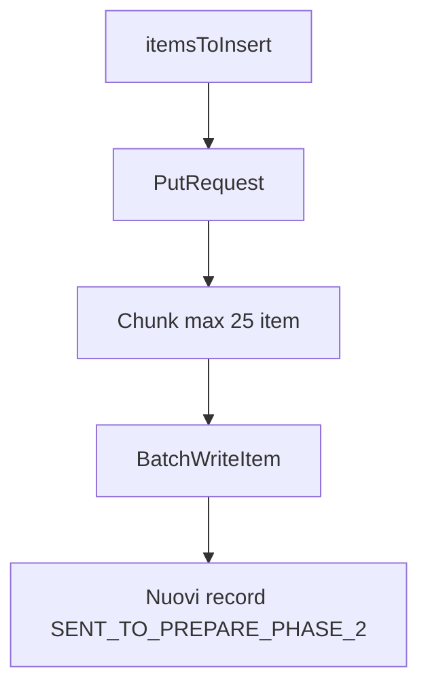
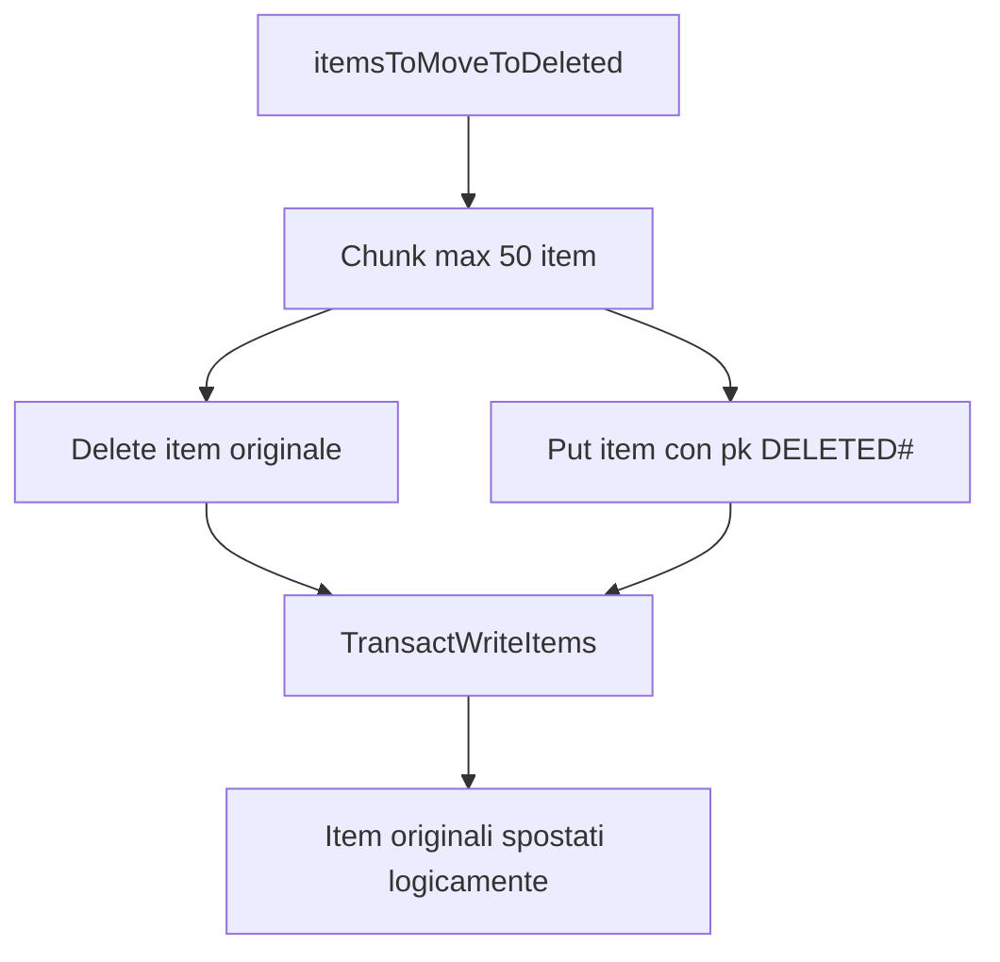
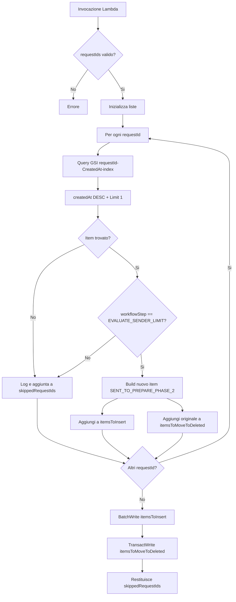
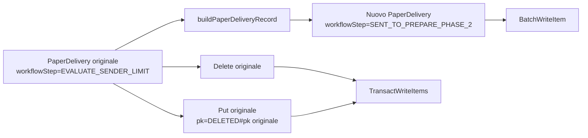

# sentPaperDeliveryToPreparePhaseTwoLambda

Lambda AWS Node.js 20 usata per gestire una lista di `requestId` ricevuti in input e inviare a `SENT_TO_PREPARE_PHASE_2` gli item più recenti presenti nello step `EVALUATE_SENDER_LIMIT`.

La Lambda lavora sulla tabella DynamoDB `PaperDelivery`, recupera per ogni `requestId` l’item più recente tramite il GSI `requestId-CreatedAt-index`, crea un nuovo record nello step `SENT_TO_PREPARE_PHASE_2` e sposta l’item originale sotto una partition key prefissata con `DELETED#`.

## Responsabilità

* Ricevere in input una lista di `requestId`.
* Per ogni `requestId`, interrogare il GSI `requestId-CreatedAt-index`.
* Recuperare solo l’item più recente associato al `requestId`, ordinando per `createdAt` in modo decrescente e usando `Limit = 1`.
* Verificare che l’item recuperato sia nello step `EVALUATE_SENDER_LIMIT`.
* Creare un nuovo record `PaperDelivery` nello step `SENT_TO_PREPARE_PHASE_2`.
* Scrivere i nuovi record in DynamoDB con `BatchWriteItem`, rispettando il limite di 25 item per batch.
* Gestire gli `UnprocessedItems` della `BatchWriteItem` con retry.
* Spostare gli item originali sotto una chiave logica `DELETED#<pk originale>` usando `TransactWriteItems`.

La Lambda non cancella le righe originali in `EVALUATE_SENDER_LIMIT`: crea nuove righe nella stessa tabella `PaperDelivery` con un nuovo workflow step.

## Entry point

```text
index.handler -> src/app/eventHandler.handleEvent
```

File principali:

| File                      | Scopo                                                                                             |
| ------------------------- | ------------------------------------------------------------------------------------------------- |
| `index.js`                | Entry point Lambda AWS.                                                                           |
| `src/app/eventHandler.js` | Valida il payload, orchestra query, trasformazione, scrittura e spostamento degli item originali. |
| `src/app/lib/dynamo.js`   | Esegue query DynamoDB, batch write e transact write.                                              |
| `src/app/lib/utils.js`    | Costruisce i nuovi record `PaperDelivery` e divide le liste in chunk.                             |

## Payload ricevuto dalla Lambda

```json
{
  "requestIds": [
    "request-id-1",
    "request-id-2",
    "request-id-3"
  ]
}
```

| Campo        | Tipo     | Descrizione                                                        |
| ------------ | -------- | ------------------------------------------------------------------ |
| `requestIds` | string[] | Lista dei requestId da processare. Campo obbligatorio e non vuoto. |

Se `requestIds` manca, non è un array o è vuoto, la Lambda termina con errore:

```text
requestIds è obbligatorio e deve essere una lista non vuota
```

## Payload restituito dalla Lambda

La Lambda restituisce la lista dei `requestId` scartati durante il processamento.

```json
[
  "request-id-2",
  "request-id-3"
]
```

Un `requestId` viene aggiunto alla lista degli scartati quando:

* non viene trovato nessun item associato;
* l’item più recente associato al `requestId` non è nello step `EVALUATE_SENDER_LIMIT`.

## Logica di processamento

### 1. Validazione input

`src/app/eventHandler.js` legge `requestIds` dal payload ricevuto in input.

La Lambda prosegue solo se `requestIds` è un array non vuoto.

```js
const requestIds = event.requestIds;

validateRequestIds(requestIds);
```

### 2. Inizializzazione liste

Durante il processamento vengono inizializzate tre liste:

```text
itemsToInsert
itemsToMoveToDeleted
skippedRequestIds
```

| Lista                  | Descrizione                                                                |
| ---------------------- | -------------------------------------------------------------------------- |
| `itemsToInsert`        | Contiene i nuovi item da scrivere nello step `SENT_TO_PREPARE_PHASE_2`.    |
| `itemsToMoveToDeleted` | Contiene gli item originali da spostare sotto la partition key `DELETED#`. |
| `skippedRequestIds`    | Contiene i requestId non processati.                                       |

### 3. Query sul GSI per requestId

Per ogni `requestId`, la Lambda esegue una query sul GSI:

```text
requestId-CreatedAt-index
```

La query usa:

```text
KeyConditionExpression = requestId = :requestId
ScanIndexForward = false
Limit = 1
```

In questo modo DynamoDB restituisce solo l’item più recente associato al `requestId`, ordinando i risultati per `createdAt` in modo decrescente.

```js
new QueryCommand({
  TableName: getTableName(),
  IndexName: REQUEST_ID_INDEX_NAME,
  KeyConditionExpression: 'requestId = :requestId',
  ExpressionAttributeValues: marshall({
    ':requestId': requestId
  }),
  ScanIndexForward: false,
  Limit: 1
})
```

### 4. Gestione item non trovato

Se la query non restituisce nessun item, la Lambda scrive un log informativo e aggiunge il `requestId` alla lista `skippedRequestIds`.

```text
Nessun item trovato per requestId=<requestId>
```

### 5. Verifica workflowStep

Se l’item viene trovato, la Lambda verifica il valore dell’attributo:

```text
workflowStep
```

Se il valore è diverso da:

```text
EVALUATE_SENDER_LIMIT
```

la Lambda interrompe l’elaborazione del singolo `requestId`, scrive un log informativo e aggiunge il `requestId` alla lista `skippedRequestIds`.

```text
RequestId=<requestId> skippato perché workflowStep=<workflowStep>
```

Se invece il valore è `EVALUATE_SENDER_LIMIT`, la Lambda:

1. aggiunge l’item originale alla lista `itemsToMoveToDeleted`;
2. costruisce un nuovo record `PaperDelivery`;
3. aggiunge il nuovo record alla lista `itemsToInsert`.

```js
itemsToMoveToDeleted.push(item);
itemsToInsert.push(buildPaperDeliveryRecord(item));
```

### 6. Trasformazione degli item

Ogni item valido viene trasformato in un nuovo record tramite `buildPaperDeliveryRecord`.

La nuova partition key è:

```text
<deliveryDate>~SENT_TO_PREPARE_PHASE_2
```

La nuova sort key è:

```text
<deliveryDate>~<requestId>
```

Il nuovo record mantiene i principali attributi dell’item originale e valorizza:

```text
createdAt = timestamp corrente
workflowStep = SENT_TO_PREPARE_PHASE_2
```

Campi copiati dall’item originale:

* `requestId`
* `notificationSentAt`
* `prepareRequestDate`
* `productType`
* `senderPaId`
* `province`
* `cap`
* `attempt`
* `iun`
* `unifiedDeliveryDriver`
* `tenderId`
* `priority`
* `recipientId`
* `deliveryDate`
* `communicationType`
* `senderPriority`
* `virtualNotificationSentAt`
* `oldSk`

Campi valorizzati o ricalcolati:

| Campo          | Valore                                   |
| -------------- | ---------------------------------------- |
| `pk`           | `<deliveryDate>~SENT_TO_PREPARE_PHASE_2` |
| `sk`           | `<deliveryDate>~<requestId>`             |
| `createdAt`    | Timestamp corrente in formato ISO.       |
| `workflowStep` | `SENT_TO_PREPARE_PHASE_2`                |

## Scrittura dei nuovi item

La lista `itemsToInsert` viene convertita in una lista di `PutRequest`.

```js
items.map(item => ({
  PutRequest: {
    Item: item
  }
}))
```

Gli item vengono poi scritti sulla tabella `PaperDelivery` tramite `BatchWriteItem`.

La Lambda divide le richieste in chunk da massimo 25 elementi, rispettando il limite di DynamoDB.



Se DynamoDB restituisce `UnprocessedItems`, la Lambda esegue retry con backoff esponenziale fino a un massimo di 3 tentativi.

Se dopo i retry rimangono item non processati, la Lambda termina con errore:

```text
Batch write failed: <numero> unprocessed items
```

## Spostamento degli item originali

La lista `itemsToMoveToDeleted` contiene gli item originali recuperati dal GSI.

La Lambda divide la lista in chunk da massimo 50 item.

Per ogni item vengono preparate due operazioni transazionali:

1. `Delete` dell’item originale usando `pk` e `sk`;
2. `Put` dello stesso item con `pk` modificata usando il prefisso `DELETED#`.

Esempio:

```text
pk originale = <pk>
pk deleted   = DELETED#<pk>
```

Ogni chunk produce al massimo:

```text
50 Delete
50 Put
```

per un totale massimo di 100 operazioni nella singola `TransactWriteItems`.



## Flusso completo



## Transizione workflow

La Lambda realizza la transizione degli item più recenti associati ai `requestId` ricevuti in input dallo step:

```text
EVALUATE_SENDER_LIMIT
```

allo step:

```text
SENT_TO_PREPARE_PHASE_2
```

Il record originale viene eliminato dalla posizione corrente e reinserito con partition key prefissata da `DELETED#`.



## Tabelle DynamoDB

### PaperDelivery

Tabella letta e scritta dalla Lambda.

Lettura tramite GSI:

```text
GSI = requestId-CreatedAt-index
requestId = <requestId>
ScanIndexForward = false
Limit = 1
```

Scrittura nuovo item:

```text
pk = <deliveryDate>~SENT_TO_PREPARE_PHASE_2
sk = <deliveryDate>~<requestId>
workflowStep = SENT_TO_PREPARE_PHASE_2
```

Spostamento item originale:

```text
Delete:
pk = <pk originale>
sk = <sk originale>

Put:
pk = DELETED#<pk originale>
sk = <sk originale>
```

## Variabili d’ambiente

| Variabile                 | Descrizione                                                               | Default | Obbligatoria |
| ------------------------- | ------------------------------------------------------------------------- | ------- | ------------ |
| `PAPERDELIVERY_TABLENAME` | Nome della tabella DynamoDB `PaperDelivery` letta e scritta dalla Lambda. | -       | Sì           |

## Costanti applicative

| Costante                            | Valore                      | Descrizione                                                           |
| ----------------------------------- | --------------------------- | --------------------------------------------------------------------- |
| `REQUEST_ID_INDEX_NAME`             | `requestId-CreatedAt-index` | Nome del GSI usato per recuperare l’item più recente per `requestId`. |
| `MAX_BATCH_WRITE_ITEMS`             | `25`                        | Numero massimo di item per singola `BatchWriteItem`.                  |
| `MAX_TRANSACTION_ITEMS`             | `100`                       | Numero massimo di operazioni per singola `TransactWriteItems`.        |
| `MAX_ITEMS_TO_MOVE_PER_TRANSACTION` | `50`                        | Numero massimo di item originali gestiti in una transazione.          |
| `MAX_BATCH_RETRIES`                 | `3`                         | Numero massimo di retry per gli `UnprocessedItems` della batch write. |

## Comandi locali

Eseguire i comandi dalla directory:

```bash
functions/sentPaperDeliveryToPreparePhaseTwoLambda
```

Installazione dipendenze:

```bash
npm install
```

Test unitari:

```bash
npm test
```

Build dello zip Lambda:

```bash
npm run build
```

## Note operative

* La Lambda processa solo l’item più recente per ogni `requestId`.
* L’ordinamento decrescente su `createdAt` viene gestito con `ScanIndexForward = false`.
* Se l’item più recente non è nello step `EVALUATE_SENDER_LIMIT`, il `requestId` viene ignorato.
* I `requestId` ignorati vengono restituiti come output della Lambda.
* I nuovi item vengono scritti con `BatchWriteItem` in chunk da massimo 25 elementi.
* Gli item originali vengono spostati con `TransactWriteItems` in chunk da massimo 50 elementi.
* Ogni item originale genera due operazioni transazionali: una `Delete` e una `Put`.
* La `Put` dell’item originale mantiene tutti i campi dell’item, modificando solo la `pk` con prefisso `DELETED#`.
* La Lambda non usa paginazione perché per ogni `requestId` recupera solo il record più recente con `Limit = 1`.
