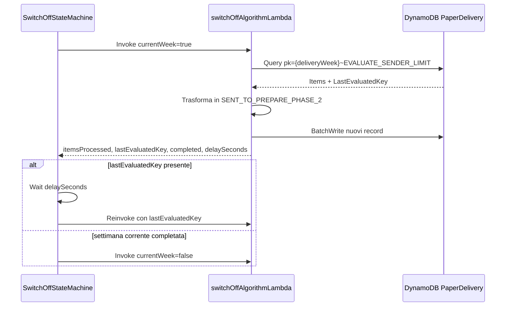
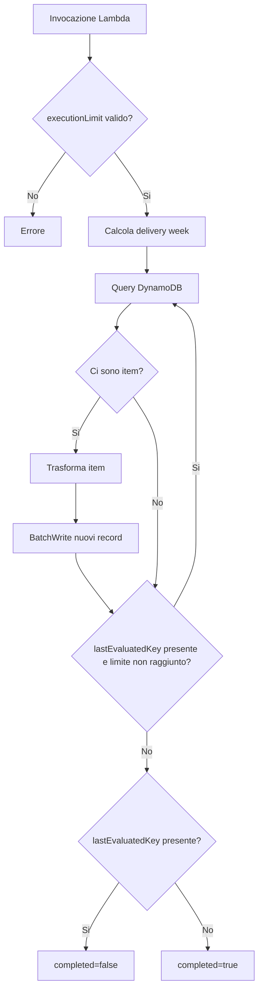
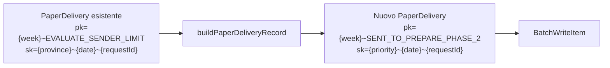

# switchOffAlgorithmLambda

Lambda AWS Node.js 20 usata per disattivare il normale algoritmo di pianificazione del delayer e inviare direttamente a `SENT_TO_PREPARE_PHASE_2` le spedizioni presenti nello step `EVALUATE_SENDER_LIMIT`.

La Lambda e invocata dalla Step Function `static/stepfunctions/definitions/SwitchOffStateMachine.json`. Lavora sulla tabella DynamoDB `PaperDelivery`, legge le spedizioni della settimana corrente e poi quelle della settimana successiva, crea nuovi record nello step finale verso prepare phase 2 e mantiene la paginazione tramite `lastEvaluatedKey`.

## Responsabilita

- Leggere le spedizioni presenti in `EVALUATE_SENDER_LIMIT` per la delivery week corrente.
- Ripetere lo stesso processamento per la delivery week successiva.
- Trasformare ogni spedizione letta in un nuovo record `SENT_TO_PREPARE_PHASE_2`.
- Ricalcolare la priorita di stampa usando `PAPER_DELIVERY_PRIORITY_PARAMETER`.
- Scrivere i nuovi record in DynamoDB con `BatchWriteItem`, rispettando il limite di 25 item per batch.
- Restituire alla Step Function lo stato della paginazione e il tempo di attesa prima di una eventuale reinvocazione.

La Lambda non cancella le righe originali in `EVALUATE_SENDER_LIMIT`: crea nuove righe nella stessa tabella `PaperDelivery` con un nuovo workflow step.

## Entry point

```text
index.handler -> src/app/eventHandler.handleEvent
```

File principali:

| File | Scopo |
|------|-------|
| `index.js` | Entry point Lambda AWS. |
| `src/app/eventHandler.js` | Valida il payload, calcola la delivery week, orchestra query, trasformazione e scrittura. |
| `src/app/lib/dynamo.js` | Esegue query DynamoDB e batch write con retry sugli unprocessed item. |
| `src/app/lib/utils.js` | Costruisce i nuovi record `PaperDelivery`, calcola priorita e chiavi DynamoDB. |

## Flusso della Step Function

La state machine `SwitchOffStateMachine` esegue il processamento in due fasi:

1. `SwitchOffAlgorithmCurrentWeek`: processa gli item della delivery week corrente.
2. `SwitchOffAlgorithmNextWeek`: processa gli item della delivery week successiva.

In entrambe le fasi la Step Function:

1. Invoca la Lambda passando `executionLimit`, `currentWeek` e l'eventuale `lastEvaluatedKey`.
2. Controlla se la Lambda ha restituito una nuova `lastEvaluatedKey`.
3. Se esiste una `lastEvaluatedKey`, attende `delaySeconds` e reinvoca la Lambda sulla stessa settimana.
4. Se non esiste una `lastEvaluatedKey`, passa alla fase successiva o termina con successo.



## Payload ricevuto dalla Lambda

La Step Function invoca la Lambda con un payload di questo tipo:

```json
{
  "executionLimit": 1000,
  "currentWeek": true,
  "lastEvaluatedKey": null
}
```

| Campo | Tipo | Descrizione |
|-------|------|-------------|
| `executionLimit` | number | Numero massimo di item da processare nella singola invocazione. Campo obbligatorio e maggiore di `0`. |
| `currentWeek` | boolean | Se `true` processa la delivery week corrente; se `false` processa la delivery week successiva. |
| `lastEvaluatedKey` | object/null | Chiave DynamoDB da cui riprendere la query paginata. Alla prima invocazione puo essere `null`. |

Se `executionLimit` manca o e minore o uguale a `0`, la Lambda termina con errore:

```text
executionLimit è obbligatorio e deve essere maggiore di 0
```

## Payload restituito dalla Lambda

```json
{
  "success": true,
  "itemsProcessed": 1000,
  "lastEvaluatedKey": {
    "pk": "2026-06-29~EVALUATE_SENDER_LIMIT",
    "sk": "MI~2026-06-29T10:15:00Z~request-id"
  },
  "completed": false,
  "delaySeconds": 30
}
```

| Campo | Descrizione |
|-------|-------------|
| `success` | Vale `true` se la Lambda completa correttamente l'invocazione. |
| `itemsProcessed` | Numero di item trasformati e scritti durante l'invocazione. |
| `lastEvaluatedKey` | Ultima chiave DynamoDB restituita dalla query. Se valorizzata, la Step Function reinvoca la Lambda. |
| `completed` | Vale `true` quando non ci sono altri item da leggere per quella settimana. |
| `delaySeconds` | Numero di secondi che la Step Function usa negli stati `Wait` prima della prossima invocazione. |

## Logica di processamento

### 1. Validazione input

`src/app/eventHandler.js` legge `executionLimit`, `lastEvaluatedKey` e `currentWeek` dal payload.

La Lambda prosegue solo se `executionLimit` e valorizzato e maggiore di `0`.

### 2. Calcolo della delivery week

La Lambda legge `DELIVERYDATEDAYOFWEEK` e lo interpreta come giorno della settimana secondo `@js-joda/core`.

```text
deliveryDate = oggi.previousOrSame(DELIVERYDATEDAYOFWEEK)
```

Se la variabile non e impostata o non e valida, viene usato il default `1`, cioe lunedi.

Il valore di `currentWeek` determina la settimana da processare:

| `currentWeek` | Partition key sorgente |
|---------------|------------------------|
| `true` | `<deliveryDate>~EVALUATE_SENDER_LIMIT` |
| `false` | `<deliveryDate + 1 settimana>~EVALUATE_SENDER_LIMIT` |

### 3. Query paginata su DynamoDB

La Lambda interroga la tabella `PaperDelivery` usando solo la partition key:

```text
pk = <deliveryWeek>~EVALUATE_SENDER_LIMIT
```

Il limite della query e:

```text
min(QUERY_LIMIT, executionLimit - itemGiaProcessati)
```

Se il payload contiene `lastEvaluatedKey`, questa viene passata a DynamoDB come `ExclusiveStartKey`.

### 4. Trasformazione degli item

Ogni item letto viene trasformato in un nuovo record `PaperDelivery` tramite `buildPaperDeliveryRecord`.

La nuova partition key e:

```text
pk = <deliveryWeek>~SENT_TO_PREPARE_PHASE_2
```

La nuova sort key e:

```text
sk = <priority>~<date>~<requestId>
```

La data usata nella sort key dipende dal tipo di spedizione:

| Condizione | Data usata |
|------------|------------|
| `productType = RS` | `prepareRequestDate` |
| `attempt = 1` | `prepareRequestDate` |
| Altri casi | `notificationSentAt` |

La priorita viene calcolata leggendo la mappa JSON in `PAPER_DELIVERY_PRIORITY_PARAMETER`. La chiave cercata nella mappa ha questa forma:

```text
PRODUCT_<productType>.ATTEMPT_<attempt>
```

Se la mappa non esiste o non contiene la combinazione prodotto/tentativo, la Lambda termina con errore.

### 5. Scrittura batch

Gli item trasformati vengono convertiti in `PutRequest` e scritti nella tabella `PaperDelivery` con `BatchWriteItem`.

`src/app/lib/dynamo.js` divide le richieste in chunk da 25 item, come richiesto da DynamoDB, e ritenta fino a 3 volte gli item rimasti non processati.

Se dopo i retry ci sono ancora item non processati, la Lambda logga l'errore e termina con:

```text
Batch write failed: <numero> unprocessed items
```

### 6. Paginazione e completamento

La Lambda continua a fare query nella stessa invocazione finche:

- DynamoDB restituisce una `lastEvaluatedKey`;
- il numero di item processati e minore di `executionLimit`.

Quando viene raggiunto `executionLimit`, la Lambda restituisce la `lastEvaluatedKey` alla Step Function. La Step Function attende `delaySeconds` e reinvoca la Lambda sulla stessa settimana.



## Transizione workflow

La Lambda realizza uno switch off dell'algoritmo perche salta gli step intermedi successivi a `EVALUATE_SENDER_LIMIT` e crea direttamente i record nello step `SENT_TO_PREPARE_PHASE_2`.



Campi copiati dal payload originale:

- `requestId`
- `notificationSentAt`
- `prepareRequestDate`
- `productType`
- `senderPaId`
- `province`
- `cap`
- `attempt`
- `iun`
- `unifiedDeliveryDriver`
- `tenderId`
- `recipientId`

Campi valorizzati o ricalcolati:

| Campo | Valore |
|-------|--------|
| `pk` | `<deliveryWeek>~SENT_TO_PREPARE_PHASE_2` |
| `sk` | `<priority>~<date>~<requestId>` |
| `createdAt` | Timestamp corrente in formato ISO. |
| `priority` | Priorita calcolata da `PAPER_DELIVERY_PRIORITY_PARAMETER`. |
| `workflowStep` | `SENT_TO_PREPARE_PHASE_2` |

## Variabili d'ambiente

| Variabile | Descrizione | Default | Obbligatoria |
|-----------|-------------|---------|--------------|
| `DELAYER_PAPER_DELIVERY_TABLE_NAME` | Nome della tabella DynamoDB `PaperDelivery` letta e scritta dalla Lambda. | - | Si |
| `PAPER_DELIVERY_PRIORITY_PARAMETER` | Mappa JSON delle priorita per prodotto e tentativo. | - | Si |
| `DELIVERYDATEDAYOFWEEK` | Giorno della settimana usato per normalizzare la delivery week. | `1` | No |
| `QUERY_LIMIT` | Limite massimo di item per singola query DynamoDB. | `1000` | No |
| `DELAY_SECONDS` | Secondi di attesa restituiti alla Step Function tra due invocazioni. | - | Si per la state machine |

Esempio di `PAPER_DELIVERY_PRIORITY_PARAMETER`:

```json
{
  "1": ["PRODUCT_AR.ATTEMPT_0"],
  "2": ["PRODUCT_RS.ATTEMPT_0", "PRODUCT_AR.ATTEMPT_1"]
}
```

## Tabelle DynamoDB

### PaperDelivery

Tabella letta e scritta dalla Lambda.

Lettura:

```text
pk = <deliveryWeek>~EVALUATE_SENDER_LIMIT
```

Scrittura:

```text
pk = <deliveryWeek>~SENT_TO_PREPARE_PHASE_2
sk = <priority>~<date>~<requestId>
workflowStep = SENT_TO_PREPARE_PHASE_2
```

La Lambda non aggiorna contatori e non elimina gli item sorgente.

## Comandi locali

Eseguire i comandi dalla directory `functions/switchOffAlgorithmLambda`.

Installazione dipendenze:

```bash
npm install
```

Test unitari:

```bash
npm test
```

Build dello zip Lambda:

```bash
npm run build
```

## Note operative

- La Lambda e progettata per essere orchestrata dalla `SwitchOffStateMachine`; l'invocazione manuale deve rispettare lo stesso contratto del payload.
- `lastEvaluatedKey` deve mantenere il formato restituito da DynamoDB DocumentClient.
- La Step Function processa prima la settimana corrente e solo dopo la settimana successiva.
- `delaySeconds` viene usato dalla Step Function negli stati `WaitForCurrentWeek`, `WaitBetweenAlgorithms` e `WaitForNextWeek`.
- La query legge tutti gli item della partition key sorgente, senza filtro sulla sort key.
- Il comportamento e additivo: ogni esecuzione crea nuovi record `SENT_TO_PREPARE_PHASE_2` e lascia invariati quelli in `EVALUATE_SENDER_LIMIT`.
